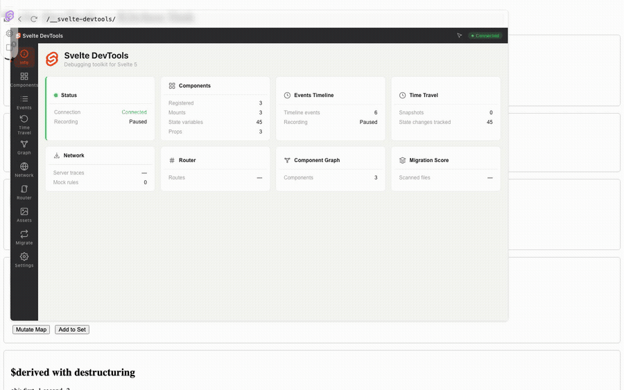

# Svelte DevTools

> Full-stack debugging for Svelte 5 and SvelteKit — component tree, state inspection, time travel, network traces, and more, in a standalone panel inside your browser.

<!--
  HERO IMAGE / GIF:
  Animated GIF showing the DevTools panel inspecting a Svelte component (captured
  headlessly with Playwright against the test app — see tests/apps/svelte/).
  hero-panel.png is a 2x static still of the full page with the panel open.
-->


[](https://www.npmjs.com/package/@fsodano/vite-plugin-svelte-devtools)
[](LICENSE)
[](https://svelte.dev)
[](https://vite.dev)
[](https://www.npmjs.com/package/@fsodano/vite-plugin-svelte-devtools)

**Svelte DevTools** is a Vite plugin that brings a standalone Svelte 5 DevTools panel directly into your browser during development. It hooks into the Vite dev server, injects `$inspect` calls at build time, and renders a live, interactive debugging panel — no browser extension required.

**Status:** v0.1.1 — Early development. APIs may change. The [completion plan](docs/plans/pending/devtools-completion.md) records observed gaps and verification status.

---

## Features

- **Component Tree** — Real-time component hierarchy with parent/child relationships, mount/unmount tracking, search, and click-to-select.
- **State & Props Inspection** — Live view of `$state`, `$derived`, `$props`, and `$effect` activity. Supports object/array destructuring, defaults, renamed keys, and `$bindable()`.
- **Time-Travel Debugging** — Record state snapshots, undo/redo through them, and restore any point in time — including **across SvelteKit routes**.
- **Event Timeline** — Chronological stream of mounts, state changes, effects, and network requests, with filter chips and a JSON detail panel.
- **Element Inspector** — Hover mode highlights Svelte components on the page with an overlay; click to jump to the component in the tree.
- **Component Graph** — Force-directed graph of the component hierarchy (vis-network).
- **Network Traces** — Server request traces (SSR + load functions, with `routeId`), client-side fetch calls, and a **mock rules** editor to stub endpoints.
- **Router Inspector** — Route inventory from the resolved SvelteKit routes directory, with route groups, parameter metadata, and navigation for static pages.
- **Asset Timings** — Performance resource timing list for loaded assets.
- **Migration Scoring** — Automatic Svelte 4 → 5 migration analysis per file, flagging legacy patterns that remain.
- **Open in Editor** — Use a component's source action to open its `.svelte` file in your IDE.
- **Agent Access** — Eight read-only MCP tools expose state, snapshots, source, routes, and migration data. A ninth tool edits writable state in an explicit live panel session. Authenticated HTTP endpoints remain available. See [MCP setup](docs/07_mcp.md).
- **Development only** — The Vite plugin uses `apply: 'serve'`. Configure the SvelteKit hook with the `dev` guard shown below.

---

## Requirements & Compatibility

| Requirement | Version |
|---|---|
| [Node.js](https://nodejs.org) | 20.19+ |
| [Vite](https://vite.dev) | 8.0.3+ (fixtures pinned to 8.2.2) |
| [Svelte](https://svelte.dev) | 5.20+ (runes mode) |
| [SvelteKit](https://kit.svelte.dev) | 2.55+ (optional — for SSR tracing) |
| [Vite DevTools host](https://github.com/vitejs/devtools) | `@vitejs/devtools@0.4.8` (tested) |

- **SvelteKit** is supported out of the box — see the [SvelteKit setup](#sveltekit) below. The extra `hooks.server.ts` step enables SSR injection and server request tracing.
- **Dev mode only.** The plugin is applied with `apply: 'serve'`, so it never runs during `vite build`. Svelte apps need `compilerOptions: { dev: true }` for full instrumentation — `@sveltejs/vite-plugin-svelte` and SvelteKit enable this automatically during development.
- **Browsers**: Chromium-based browsers are tested. The DevTools panel loads in an iframe served from the same dev server (same-origin).

---

## Installation

Add the plugin and the Vite DevTools Kit peer dependency to your dev dependencies:

```bash
# npm
npm install -D @fsodano/vite-plugin-svelte-devtools @vitejs/devtools@0.4.8

# pnpm
pnpm add -D @fsodano/vite-plugin-svelte-devtools @vitejs/devtools@0.4.8

# yarn
yarn add -D @fsodano/vite-plugin-svelte-devtools @vitejs/devtools@0.4.8
```

> `@vitejs/devtools` provides the dock/host panel that Svelte DevTools registers into. If your package manager does not auto-install peer dependencies, install it manually — the plugin will not show up without it.

---

## Usage (Vite Configuration)

**Order matters.** Place `DevTools()` first (it provides the host panel), then the Svelte/SvelteKit plugin, then `svelteDevTools()`:

### Plain Vite + Svelte

```typescript
// vite.config.ts
import { defineConfig } from 'vite';
import { svelte } from '@sveltejs/vite-plugin-svelte';
import { DevTools } from '@vitejs/devtools';
import { svelteDevTools } from '@fsodano/vite-plugin-svelte-devtools';

export default defineConfig({
  plugins: [
    DevTools(),      // Vite DevTools host panel
    svelte(),        // Svelte 5 plugin
    svelteDevTools() // Svelte DevTools (after svelte())
  ]
});
```

### SvelteKit

```typescript
// vite.config.ts
import { defineConfig } from 'vite';
import { sveltekit } from '@sveltejs/kit/vite';
import { DevTools } from '@vitejs/devtools';
import { svelteDevTools } from '@fsodano/vite-plugin-svelte-devtools';

export default defineConfig({
  plugins: [
    DevTools(),
    sveltekit(),
    svelteDevTools()
  ]
});
```

SvelteKit bypasses Vite's `transformIndexHtml` during SSR, so the DevTools scripts must be injected through a handle hook:

```typescript
// src/hooks.server.ts
import { dev } from '$app/environment';
import type { Handle } from '@sveltejs/kit';
import { svelteDevToolsHandle, noopHandle } from '@fsodano/vite-plugin-svelte-devtools/sveltekit';

export const handle: Handle = dev ? svelteDevToolsHandle() : noopHandle();
```

The `svelteDevToolsHandle()` helper injects both the Vite DevTools client and the Svelte runtime scripts into every server-rendered response via `transformPageChunk`, and traces SSR requests. `noopHandle()` is a zero-overhead pass-through for production.

### Opening the panel

1. Start the dev server (`npm run dev`).
2. Click the **Vite** floating button in the bottom-right corner of your page.
3. Authorize the session with the code shown by the installed DevTools host.
4. Select the **Svelte** entry in the dock — the DevTools panel opens.

---

## Configuration Options

`svelteDevTools()` accepts an optional options object:

```typescript
import type { SvelteDevToolsPluginOptions } from '@fsodano/svelte-devtools-types';

svelteDevTools({
  // File patterns to include for transformation (default: [/\.svelte$/])
  include: [/\.svelte$/],

  // File patterns to exclude from transformation (default: [/node_modules/])
  exclude: [/node_modules/, /\.svelte-kit/],

  // Enable $inspect injection (default: true).
  // Set false to disable state inspection.
  enableStateInspection: true
});
```

| Option | Type | Default | Description |
|---|---|---|---|
| `include` | `RegExp[]` | `[/\.svelte$/]` | Which files the build-time transform processes. |
| `exclude` | `RegExp[]` | `[/node_modules/]` | Files to skip. `.svelte-kit/generated/` files are always skipped. |
| `enableStateInspection` | `boolean` | `true` | Enable injected state inspection. Set `false` to disable it. |

Debug logging is toggled with an environment variable:

```bash
SVELTE_DEVTOOLS_DEBUG=true npm run dev
```

---

## Notices & Caveats

- **Production safety** — The plugin has `apply: 'serve'`, so it is completely absent from `vite build` output. Your end-user bundle is untouched.
- **SSR / SvelteKit** — DevTools instrumentation runs on the client. In SvelteKit you *must* add the `hooks.server.ts` handle (see above) or the panel will not appear in SSR responses.
- **Client is served from `dist/`** — The DevTools panel at `/__svelte-devtools/` is pre-built; changes to the client source require `npm run build` in `packages/client` (monorepo contributors) before they appear.
- **Vite DevTools authorization** — Each browser session must be authorized once against the dev server. The supported host uses a devframe authorization code. Older host versions use a single-use Manual Auth Token that can change on new connections.
- **Time travel requires recording** — The Time Travel panel starts "Paused". Click the Record button before interacting with your app, or no snapshots are captured.
- **Multiple Svelte apps on one page** — The runtime tracks components via a single `window.__SVELTE_DEVTOOLS_RUNTIME__` global and `data-svelte-devtools-id` attributes; multiple independent Svelte apps mounted on the same page are supported as long as each is transformed by the plugin.
- **Mock scope** — Rules intercept browser fetch only. They do not intercept server fetch, and the live bridge preserves native XMLHttpRequest.
- **State edits** — Writable JSON-compatible state supports inspector and session-targeted agent edits. Derived values and non-JSON values remain read-only.
- **Pre-built libraries** — State in `.svelte` components compiled *before* the plugin was added (e.g. published component libraries) cannot be instrumented; only source files the plugin transforms are tracked.

---

## How It Works

```
.svelte file → [Vite transform] → $inspect injection + registry metadata
                                    ↓ (dev server)
                     browser runtime (window.__SVELTE_DEVTOOLS_RUNTIME__)
                                    ↓ postMessage { source: 'svelte-devtools', ... }
                        DevTools panel iframe (window bridge → runes store)
```

| Stage | What happens |
|---|---|
| **Build** | The plugin parses each `.svelte` file with the Svelte compiler, walks the script AST with Babel, and injects `$inspect(...).with(...)` hooks after every `$state`/`$derived`/`$props` declaration, registers component metadata (`svt-*` id, name, filename, `propKeys`), adds `data-svelte-devtools-id`/`data-svelte-component` attributes, and instruments `$effect` callbacks. |
| **Runtime** | The browser runtime catches `$inspect` callbacks (`handleState`), detects mounts/unmounts via a `MutationObserver` on `data-svelte-devtools-id`, intercepts `window.fetch` for client request traces, and emits structured events via `postMessage`. |
| **UI** | The panel (an iframe dock in Vite DevTools) receives events through a window bridge, debounces/batches state updates in a runes store, and renders the tree, timeline, graph, network traces, and time-travel console. Snapshots are captured client-side and applied back to live runes via registered setters (`_registerState`/`setComponentState`). |

Svelte 5 runes are compile-time transforms that do not exist at runtime. `$inspect` is the official Svelte 5 API for observing state values — injecting it at build time lets DevTools track state without modifying the Svelte runtime or your source.

---

## Agent API

For an MCP client, use the [local stdio server](docs/07_mcp.md). Start with `svelte_status`, choose a panel session, then use `svelte_components` with `includeState: false` for metadata discovery. Runtime inspection requires an open, authorized Svelte panel. HTTP responses carry a cache timestamp; MCP rejects missing or stale runtime data. Use `svelte_set_state` with an explicit session from status for acknowledged live edits. Remote snapshot restore is not implemented.

AI coding assistants and automation can inspect a running app through typed RPC methods registered on the Vite DevTools context, or through plain HTTP endpoints. All RPC responses follow the `AgentResponse<T>` schema:

```typescript
interface AgentResponse<T> {
  ok: boolean;
  data?: T;
  error?: { code: string; message: string };
  timestamp: number;
}
```

### RPC Methods (live)

| Method | Type | Description |
|---|---|---|
| `svelte-devtools:build-status` | query | Build health: component count, tracked runes, errors. |
| `svelte-devtools:get-components` | query | List all registered components with metadata (rune counts, migration result). |
| `svelte-devtools:component-state` | query | Metadata for one component by its `svt-*` id. |
| `svelte-devtools:migration-score` | query | Svelte 4 → 5 migration progress; `overall` is `null` until components are scored. |
| `svelte-devtools:open-in-editor` | mutation | Open a file at a line in the editor. |
| `svelte-devtools:rescan` | mutation | Force a full-reload so all components are re-analyzed. |

### HTTP API

Everything is also exposed as JSON at `/__svelte-devtools/api/` on the dev server. Every request requires the per-run token: send it as an `Authorization: Bearer <token>` header. The panel uses periodic authenticated `fetch` for sync. Query-token compatibility is available for clients that cannot set headers. Requests without a valid token get `401`. Set `SVELTE_DEVTOOLS_TOKEN` before starting the dev server to fix the token for scripts, or copy the token printed in the server terminal.

CORS is allow-listed, not wildcard. The API reflects an origin only for `http://localhost:*`, `http://127.0.0.1:*`, and any origin you configure (see `SVELTE_DEVTOOLS_ALLOWED_ORIGINS`). Requests without an `Origin` header get no CORS header at all.

| Method | Endpoint | Description |
|---|---|---|
| `GET` | `/api/` | Plugin status and available endpoints. |
| `GET` | `/api/components` | All components and state (synced from the panel). |
| `GET` | `/api/timeline` | Timeline events (mounts, state changes, effects). |
| `GET` | `/api/server-events` | Server request traces with response previews. |
| `GET` | `/api/migration` | Svelte 4→5 migration scores; `overall` is `null` until components are scored. |
| `GET` | `/api/snapshots` | Snapshot branch tree (`parentId`, `branchId`, timestamps). |
| `GET` | `/api/routes` | SvelteKit route inventory from the resolved routes directory. |
| `GET` | `/api/remote` | Remote-debugging payload synced from the panel. |
| `GET` | `/api/source?file=<path>` | Source file lookup with line numbers. |
| `POST` | `/api/set-state` | Acknowledged live edit of `{sessionId, componentId, key, value}`. |
| `POST` | `/api/sync` | (internal) The panel syncs runtime state here every 2s. |

```bash
# Quick health check
curl -H "Authorization: Bearer $SVELTE_DEVTOOLS_TOKEN" \
  http://localhost:5173/__svelte-devtools/api/

# List components
curl -H "Authorization: Bearer $SVELTE_DEVTOOLS_TOKEN" \
  http://localhost:5173/__svelte-devtools/api/components | jq '.count, .components[].name'
```

---

## Package Structure

```
packages/
  vite-plugin/   Vite plugin: transforms, SvelteKit hooks, server tracing, HTTP API
  runtime/       Browser runtime: $inspect handling, component registry, postMessage, inspector
  client/        DevTools panel UI (Svelte 5, 10 tabs, built with Vite → dist/)
  types/         Shared TypeScript types and constants
  mcp/           Stdio MCP server over the authenticated HTTP API
```

---

## Development

This is an npm workspaces monorepo.

```bash
# Install dependencies
npm install

# Build all packages (order: types → runtime → vite-plugin → client)
npm run build

# Run the test suite (builds everything, then vitest)
npm test

# Run the SvelteKit test app (port 5174) or plain Vite app (port 5173)
cd tests/apps/svelte-kit && npm run dev
```

Individual package builds:

```bash
npm run build:types        # @fsodano/svelte-devtools-types
npm run build:runtime      # @fsodano/svelte-devtools-runtime
npm run build:vite-plugin  # @fsodano/vite-plugin-svelte-devtools
npm run build:client       # @fsodano/svelte-devtools-client
npm run build:mcp          # @fsodano/svelte-devtools-mcp
```

**Important for contributors:** the DevTools panel is served from `packages/client/dist/`, not compiled on demand. After changing `packages/client/src/`, rebuild with `npm run build:client` (or `npm run build`), then restart the dev server. See [docs/00_index.md](docs/00_index.md) for the quick start and [docs/INDEX.md](docs/INDEX.md) for the developer workflow.

### Internal dependencies are plain semver

This monorepo uses npm workspaces. Publishable packages reference sibling packages with **plain semver ranges** — e.g. `"@fsodano/svelte-devtools-types": "^0.1.1"` — never `file:` or `workspace:` specifiers. npm is the package manager: it does not support the `workspace:` protocol, and `file:` paths would be packed verbatim into published manifests, breaking consumer installs.

During development, npm resolves those ranges against the local workspace copies (the workspace versions satisfy the ranges), so builds keep using freshly compiled siblings. Published tarballs carry the same registry-safe ranges with no rewrite step.

Run the full release validation without publishing:

```bash
bash scripts/publish.sh --dry-run
```

The script builds all packages, checks types, runs unit and browser tests, then checks every package with `npm pack --dry-run`. The package check rejects `file:` and `workspace:` dependency ranges and missing built entry points. For a package-only check after a build, run `npm run release:check`.

When an npm release is intended, `bash scripts/publish.sh --publish` runs the same gates before publishing in dependency order. It accepts optional `--tag TAG` and `--otp CODE` arguments. `scripts/release.sh` delegates to the same workflow. Validation is the default when no publish flag is supplied. See [ADR-0014](docs/adr/ADR-0014-publish-safe-workspace-dependencies.md) for the full decision.

---

## Acknowledgements

- [Vite DevTools Kit](https://github.com/vitejs/devtools) — the host panel, dock system, and RPC infrastructure this plugin builds on.
- [vuejs/devtools](https://github.com/vuejs/devtools) — design inspiration for the panel UX (see [docs/inspiration.md](docs/inspiration.md)).
- [svelte-devtools (Chrome extension)](https://github.com/sveltejs/svelte-devtools) — prior art for Svelte component inspection.

---

## Documentation

- [Index & Quick Start](docs/00_index.md)
- [Architecture & Data Flow](docs/01_architecture.md)
- [Vite Plugin Details](docs/02_vite-plugin.md)
- [Runtime](docs/03_runtime.md)
- [Client UI](docs/04_client.md)
- [Server Integration](docs/05_server.md)
- [API Reference](docs/06_api.md)
- [Architecture Decision Records](docs/adr/)

## License

[MIT](LICENSE)
