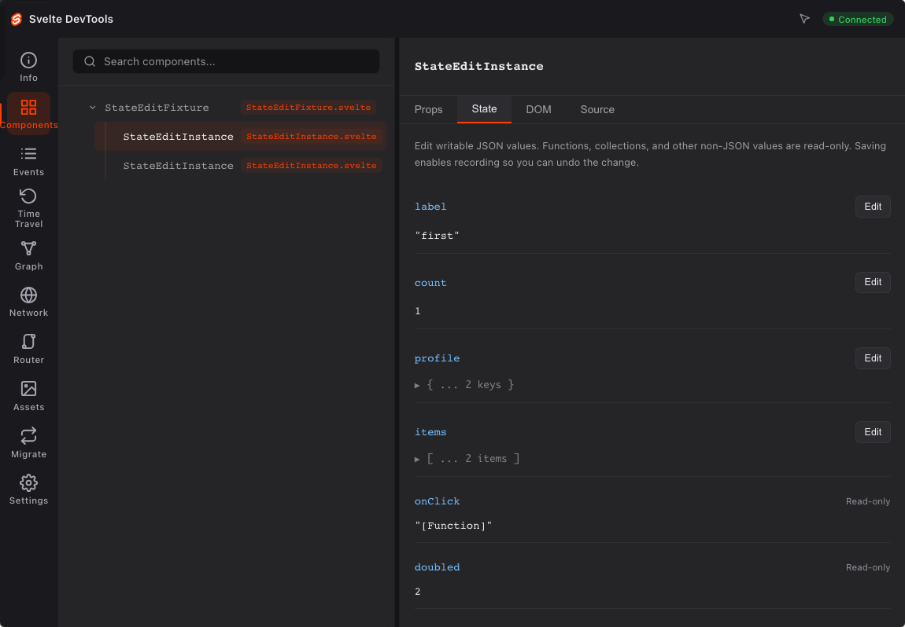
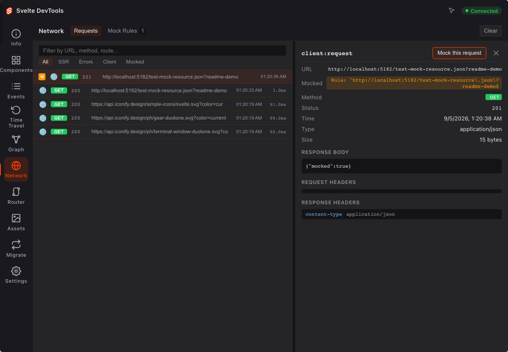
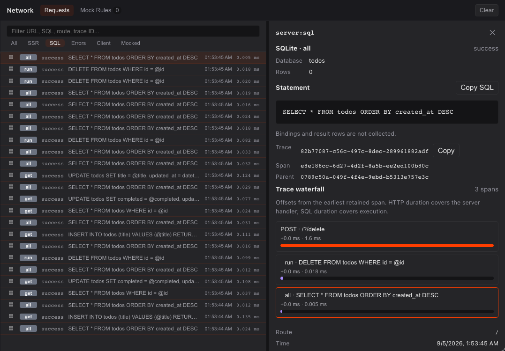

# Svelte DevTools

**See what your Svelte app is doing. Give your agent the same view.**

Inspect live component instances, follow state changes, replay snapshots, and turn a captured request into a fetch mock. Connect an AI coding assistant through MCP to inspect the running app and make acknowledged state edits in a specific browser session.

Svelte DevTools runs beside your app in the Vite DevTools dock. It is a development plugin for **Svelte 5.20+ and SvelteKit**, with no browser extension to install.

[](https://github.com/fsodano/svelte-devtools/actions/workflows/ci.yml) [](https://github.com/fsodano/svelte-devtools/releases) [](LICENSE)



*Captured from the included plain Svelte app. The panel runs beside the application in the Vite DevTools dock.*

**Early development · v0.2.1.** APIs may change. This is an independent community project, inspired by Vue DevTools; it is not an official Svelte project.

[Try it locally](#try-it-locally) · [Connect your agent](#connect-your-agent) · [Explore the tools](#explore-the-tools) · [Sample apps](#sample-apps) · [Contribute](#develop-locally)

## What you can do with it

- **Find the component behind a screen element.** Inspect each mounted instance separately, including repeated cards and list items. Follow its parent layout or page, read its props, and open its source in your editor.
- **Try a different state without rebuilding a scenario.** Edit writable JSON state in the panel, then use recorded snapshots to undo and redo. Functions and other unsupported values stay read-only.
- **Test a different API response.** Turn a captured browser fetch into a mock rule, change its response, and repeat the action in your app.
- **Follow a request into the database.** See SvelteKit request and fetch spans alongside explicitly instrumented SQLite calls. Inspect the SQL template, measured duration, row count, and request relationship in one trace.
- **Let an agent inspect the running app.** Nine MCP tools expose components, source, events, routes, snapshots, and acknowledged state edits in a selected browser session. Freshness checks help distinguish current observations from stale data.
- **Arrange the workspace around the task.** Resize detail panes, choose readable text and theme settings, and move between the application, component source, and trace details.

The tool runs during development. Runtime agent inspection requires an open, authorized panel. Browser mocks do not intercept server requests, and state time travel does not roll back database writes.

## Try it locally

Use **Node.js 22.12+**, Svelte 5.20+, and Vite 8. In an existing Svelte application:

```bash
npm install -D @fsodano/vite-plugin-svelte-devtools@0.2.1 @vitejs/devtools@0.4.8
```

Add the [Vite configuration below](#integrate-with-your-app). SvelteKit also needs the development handle. Start your app, open the Vite dock, authorize with the terminal's **six-digit devframe code**, and choose **Svelte**. No browser extension is required.

To try a complete application instead, use one of the [four sample apps](#sample-apps). They run Vite **8.2.2**, powered by Rolldown, with DevTools host **0.4.8**. Chromium is the tested browser.

## Connect your agent

A coding assistant should be able to check the running application, not just reason from source. The local MCP server gives it typed tools to discover mounted instances, inspect current values, read source and events, and edit writable state. The browser panel and agent use the same captured application data.

### Start the app and MCP server

In your application directory, choose a local API token and start or restart the development server:

```bash
export SVELTE_DEVTOOLS_TOKEN=replace-with-your-local-token
npm run dev
```

Open the app, authorize the dock, and **keep the Svelte panel open**. The API token is separate from the dock's six-digit code.

Add this server to an MCP-compatible client. Replace the app URL and token:

```json
{
  "mcpServers": {
    "svelte-devtools": {
      "command": "npx",
      "args": ["-y", "@fsodano/svelte-devtools-mcp@0.2.1"],
      "env": {
        "SVELTE_DEVTOOLS_URL": "http://localhost:5173",
        "SVELTE_DEVTOOLS_TOKEN": "replace-with-your-local-token"
      }
    }
  }
}
```

Keep real tokens out of version control. See the [MCP guide](docs/07_mcp.md) for transport limits, freshness checks, and error handling.

[](docs/media/agent-state-edit.mp4)

*Recorded in the plain Svelte example: an MCP state edit followed by undo and redo in the panel. [Watch the video](docs/media/agent-state-edit.mp4).*

### Give it a concrete debugging task

> Inspect the mounted counter in my running app. Explain which values change when I increment it. Set its writable count to 5, verify the result, and show me the associated timeline and snapshot records.

A typical tool sequence is:

1. Call `svelte_status` and select a live session from `capabilities.sessions`.
2. Discover components with `svelte_components({ sessionId, includeState: false, limit: 50 })`.
3. Read the target with `svelte_components({ sessionId, id: componentId })`, then inspect its source if needed.
4. Edit it with `svelte_set_state({ sessionId, componentId, key: "count", value: 5 })`.
5. Wait for the next panel sync, then check state, timeline, and snapshot metadata.

These are tool-call examples; use IDs returned by the running app. Each mounted component has its own ID, including repeated instances of the same file.

**Edits are acknowledged by the live panel.** A successful edit enables recording and uses the same state setter as the inspector. Snapshot capture follows through runtime events. If a command returns `OUTCOME_UNKNOWN`, inspect the state before retrying: it may already have applied. The server does not automatically retry mutations.

| MCP tool | What an agent can inspect or do |
|---|---|
| `svelte_status` | Check capabilities, sessions, and sync readiness. |
| `svelte_components` | Discover instances; read their state, props, and relationships. |
| `svelte_timeline` | Read filtered, paginated runtime events. |
| `svelte_snapshots` | Inspect snapshot and branch metadata. |
| `svelte_routes` | Read the SvelteKit route inventory. |
| `svelte_migration` | Find legacy Svelte patterns in transformed files. |
| `svelte_server_events` | Read captured server request traces. |
| `svelte_source` | Read a bounded source excerpt inside the project root. |
| `svelte_set_state` | Edit writable JSON state in an explicit live session. |

Runtime reads reject missing or stale caches. Start with metadata-only discovery to keep large component trees manageable. MCP does not collect runtime data without an open panel, and it does not provide remote snapshot restore.

Prefer a script? The same local server exposes an [authenticated HTTP API](docs/06_api.md). In a second terminal, export the same token used to start the app:

```bash
export SVELTE_DEVTOOLS_TOKEN=replace-with-your-local-token
curl -H "Authorization: Bearer $SVELTE_DEVTOOLS_TOKEN" \
  http://localhost:5173/__svelte-devtools/api/
```

The repository includes [integration instructions for agents](skills/implement-devtools.md) and a [debugging workflow](skills/debug-with-devtools.md).

## Explore the tools

### Find the component behind the UI

Select an element on the page or search the component tree. Inspect that **specific mounted instance**, its props, current state, and source. The graph shows component relationships, including SvelteKit layouts and pages.

For example, the Pokédex renders about 20 `PokemonCard` instances per page. Select different cards to compare their individual props rather than inspecting one entry for the whole file. Use the source action to open the component in your editor; configure `LAUNCH_EDITOR` when automatic editor detection is not enough.

### Change state, then step back

Edit a writable JSON value in Components to explore a state that would otherwise require several interactions. Saving starts recording, captures the baseline, and applies the live setter. Use Time Travel to undo and redo the change.

To record ordinary application interactions, open Time Travel and click **Record** first. It starts paused. Snapshots show the sequence of captured state changes. Continuing from an earlier state can discard future snapshots.

Derived values and non-JSON values, such as functions, remain read-only. State replay is a debugging aid; it does not undo an external side effect such as a database write.

### Turn a request into a mock

Open Network, select a captured browser fetch, and create a mock rule from it. The draft carries the request URL and method plus the captured response fields. Adjust the response and enable the rule, then repeat the action in your app.

Use this to test an empty result, a different response body, or an error status without changing your backend. Response previews are bounded; review the draft before saving it. Rules intercept **browser fetch**, not server fetch or XMLHttpRequest.

[](docs/media/network-mocking.mp4)

*[Watch the request-to-mock walkthrough](docs/media/network-mocking.mp4), recorded against the included Svelte example.*

### Follow events and server requests

Events shows mounts, unmounts, state updates, and effects with details you can inspect. Open Network to inspect SvelteKit requests, fetches, and SQL spans with a correlated waterfall. `svelte_server_events` and the authenticated `/__svelte-devtools/api/server-events` endpoint expose the same IDs, durations, and captured data. Use them to connect a visible UI change with the requests around it.

These are development traces. Explicit SQLite spans include a bounded statement template, operation, duration, row count, and direct request parent. Statement capture is opt-in; bindings and result rows are omitted. See [SQLite setup and limits](docs/05_server.md#observe-a-sqlite-query).



*Captured from the included Todo app during real SQLite CRUD.*

### Keep the workspace comfortable

Resize the component, event, network, asset, and time-travel detail panes. Splitters support dragging and keyboard adjustment; narrow layouts stack vertically. Settings persists theme, text size, and motion preferences.

Additional views include the SvelteKit route inventory, browser asset timings, and migration analysis for legacy Svelte patterns. [Client documentation](docs/04_client.md) describes the panels and their scope.

## Sample apps

The repository ships four applications. Each has its own dependencies and README. Clone and build the root packages first, then install the selected app with `npm ci --prefix <path>`.

```bash
git clone https://github.com/fsodano/svelte-devtools.git
cd svelte-devtools
npm ci
npm run build
```

| App | What to explore | Start command from the repository root |
|---|---|---|
| [Plain Svelte](tests/apps/svelte/README.md) | Counters, state edits, repeated instances, and time travel without SvelteKit. | `npm run dev --prefix tests/apps/svelte -- --port 5173 --strictPort` |
| [SvelteKit](tests/apps/svelte-kit/README.md) | Server rendering, routes, layout relationships, and the animated counter. | `npm run dev --prefix tests/apps/svelte-kit -- --port 5174 --strictPort` |
| [SQLite todo list](tests/apps/todo-sqlite/README.md) | Persistent CRUD, SvelteKit requests, and state changes in a database-backed app. | `npm run dev --prefix tests/apps/todo-sqlite -- --port 5175 --strictPort` |
| [Pokédex](tests/apps/pokedex/README.md) | Repeated card instances, remote fetches, selection, and mock rules. | `npm run dev --prefix tests/apps/pokedex -- --port 5176 --strictPort` |

For example:

```bash
npm ci --prefix tests/apps/todo-sqlite
npm run dev --prefix tests/apps/todo-sqlite -- --port 5175 --strictPort
```

The Pokédex uses an external API and needs network access during normal use. The todo app uses `better-sqlite3`, which may need native build tooling on platforms without a matching prebuilt binary. Its README explains the local database.

## Integrate with your app

Install the plugin and host shown in [Try it locally](#try-it-locally). Plain Vite projects also need their normal `@sveltejs/vite-plugin-svelte@^7` integration. The examples use local package references for development; see the [integration guide](skills/implement-devtools.md).

The Vite configuration has three parts: the DevTools host, Svelte, and this plugin.

```ts
import { defineConfig } from 'vite';
import { svelte } from '@sveltejs/vite-plugin-svelte';
import { DevTools } from '@vitejs/devtools';
import { svelteDevTools } from '@fsodano/vite-plugin-svelte-devtools';

export default defineConfig({
  plugins: [DevTools(), svelte(), svelteDevTools()]
});
```

For SvelteKit, replace `svelte()` with `sveltekit()` from `@sveltejs/kit/vite`. Add the development hook to `src/hooks.server.ts`:

```ts
import { dev } from '$app/environment';
import type { Handle } from '@sveltejs/kit';
import {
  svelteDevToolsHandle,
  noopHandle
} from '@fsodano/vite-plugin-svelte-devtools/sveltekit';

export const handle: Handle = dev ? svelteDevToolsHandle() : noopHandle();
```

If your app already has a handle hook, see the [server integration guide](docs/05_server.md) before composing it. The Vite plugin runs only during development; keep the `dev` guard on the server hook.

[Plugin options](docs/02_vite-plugin.md) cover file filters and state instrumentation. [Architecture](docs/01_architecture.md) explains the transform, runtime, panel, and API.

## Develop locally

The root is an npm workspace with five packages:

| Package | Responsibility |
|---|---|
| `packages/vite-plugin` | Instrumentation, SvelteKit hooks, HTTP API, and editor integration. |
| `packages/runtime` | Live component registration, state events, and element inspection. |
| `packages/client` | The Svelte panel and its debugging workflows. |
| `packages/types` | Shared contracts and value handling. |
| `packages/mcp` | Local stdio tools over the authenticated API. |

Start with the [contribution guide](CONTRIBUTING.md) and [developer docs index](docs/INDEX.md). For a local validation run:

```bash
npm ci
npm run build
npm run check
npx vitest run

# Browser tests start their own fixtures on ports 5173 and 5174.
npm ci --prefix tests/apps/svelte
npm ci --prefix tests/apps/svelte-kit
npx playwright install chromium
npm run test:e2e

# Validate the five package artifacts without publishing.
npm run release:check
```

**The panel is served from `packages/client/dist/`.** After editing the client, run `npm run build:client` and restart the example server. For changes across packages, run `npm run build`. Refresh the browser, verify the API data, and check the visible result.

Focused real-app checks are available in `scripts/verify-pokedex.mjs`, `scripts/verify-time-travel.mjs`, and `scripts/verify-stress.mjs`. See the [developer index](docs/INDEX.md) for their setup and port requirements. `bash scripts/publish.sh --dry-run` runs the full release gate without publishing.

## Scope and project notes

- Svelte **5.20+** is required for instance identity. Current fixtures use Vite **8.2.2** and DevTools host **0.4.8**.
- Instrumentation covers component source processed by the plugin. Precompiled libraries and standalone `.svelte.ts` rune modules are outside the current scope.
- Runtime inspection requires an open, authorized panel. Browser coverage is Chromium; cross-browser parity is not claimed.
- The [completion audit](docs/validation/devtools-completion-audit.md) records verification and remaining limits. [Design guidelines](docs/design-guidelines.md) and [architecture decisions](docs/adr/) explain project choices.

Built on [Vite DevTools](https://github.com/vitejs/devtools), with inspiration from [Vue DevTools](https://github.com/vuejs/devtools) and the existing [Svelte DevTools extension](https://github.com/sveltejs/svelte-devtools).

[MIT licensed](LICENSE). Contributions, focused bug reports, and reproducible sample apps are welcome.
