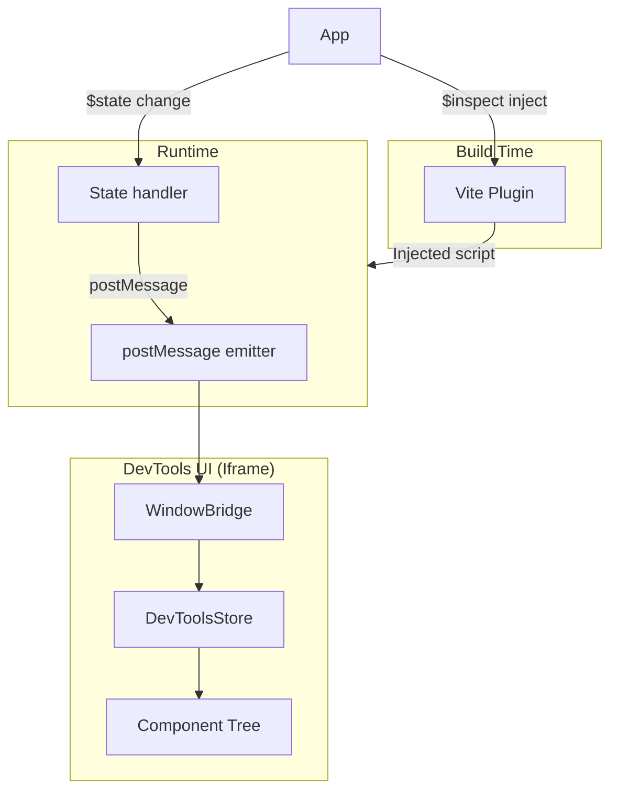

# Svelte DevTools Documentation

Full-stack debugging for Svelte 5 and SvelteKit applications, built on Vite DevTools Kit.

## Overview

Svelte DevTools provides real-time component inspection, state tracking, and timeline visualization for Svelte 5 applications. This implementation integrates directly with Vite's development server for a seamless cross-browser debugging experience.

## Features

- **Component Tree**: Visualize your Svelte component hierarchy with parent-child relationships
- **State Inspection**: Track `$state`, `$derived`, `$props` runes in real-time
- **Timeline**: View chronological event history (mounts, updates, effects) (NOT YET)
- **Server-Side Tracing**: Basic HTTP request tracing via Vite middleware (experimental)
- **Motion Tracking**: Automatic tracking of Spring/Tween instances from `svelte/motion`
- **Zero Production Impact**: All dev tools code is dev-only

## Architecture

The system uses **build-time $inspect injection** for state tracking and **postMessage** for event-driven UI updates:



## Quick Start

### 1. Install the Plugin

**Development** (package not yet published):

```bash
# From this repo
npm install
npm run build

# In your project
npm link ../../svelte-dev-extension/packages/vite-plugin
npm install @vitejs/devtools
```

**Production** (once published):

```bash
npm install @svelte-devtools/vite-plugin
```

### 2. Configure Vite

**Plain Vite:**

```typescript
// vite.config.ts
import { defineConfig } from 'vite';
import { DevTools } from '@vitejs/devtools';
import { svelte } from '@sveltejs/vite-plugin-svelte';
import { svelteDevTools } from '@svelte-devtools/vite-plugin';

export default defineConfig({
  plugins: [DevTools(), svelte(), svelteDevTools()]
});
```

**SvelteKit:**

```typescript
// vite.config.ts
import { defineConfig } from 'vite';
import { sveltekit } from '@sveltejs/kit/vite';
import { DevTools } from '@vitejs/devtools';
import { svelteDevTools } from '@svelte-devtools/vite-plugin';

export default defineConfig({
  plugins: [DevTools(), sveltekit(), svelteDevTools()]
});

// src/hooks.server.ts
import type { Handle } from '@sveltejs/kit';
import { svelteDevToolsHandle, noopHandle } from '@svelte-devtools/vite-plugin/sveltekit';

export const handle: Handle = dev ? svelteDevToolsHandle() : noopHandle();
```

### 3. Start Development

```bash
npm run dev
```

### 4. Open DevTools

1. Look for the **Vite** floating overlay button in the bottom-right corner of your page
2. Click it to open the Vite DevTools panel
3. Select the **Svelte** tab from the dock
4. View your component tree and state

## Documentation Structure

| # | Document                             | Description |
|---|--------------------------------------|-------------|
| 1 | [Architecture](./01_architecture.md) | System design, data flow, and key decisions |
| 2 | [Vite Plugin](./02_vite-plugin.md)   | Build-time transforms and configuration |
| 3 | [Runtime](./03_runtime.md)           | $inspect injection and state tracking |
| 4 | [Client UI](./04_client.md)          | DevTools panel implementation |
| 5 | [Server Integration](./05_server.md) | SvelteKit request tracing (experimental) |
| 6 | [API Reference](./06_api.md)        | Public API and type definitions |

## Suggested Reading Order

1. **Start here** (00_index.md) - Get an overview
2. **Architecture** (01_architecture.md) - Understand the system design
3. **Vite Plugin** (02_vite-plugin.md) - Learn build-time transforms
4. **Runtime** (03_runtime.md) - Understand $inspect injection
5. **Client UI** (04_client.md) - See how the UI works
6. **API Reference** (06_api.md) - Reference for types and APIs

## Package Structure

```
packages/
├── vite-plugin/       - Build-time transforms
├── runtime/           - State handling
├── client/            - DevTools UI (iframe)
└── types/            - Shared TypeScript types
```

> **Note**: The runtime package receives state changes via `$inspect` injection and emits events via `postMessage` for the DevTools UI.

## How It Works

### Build Time

The Vite plugin transforms each `.svelte` file during development:

1. **Component Registration**: Injects registry entry with stable ID
2. **Data Attributes**: Adds `data-svelte-devtools-id` to root element
3. **$inspect Injection**: Wraps `$state`, `$derived` calls with `$inspect` hooks

### Runtime

**Runtime Package**:
1. **Receives State**: `$inspect` callbacks call `window.__SVELTE_DEVTOOLS_RUNTIME__.handleState()`
2. **Tracks Components**: Maintains component registry with state values
3. **Emits Events**: Uses `postMessage` for real-time updates
4. **Exposes API**: `window.__SVELTE_DEVTOOLS_RUNTIME__`

### DevTools UI

The iframe-based UI:

1. **Listens to Events**: Receives `postMessage` from runtime package
2. **Displays Tree**: Hierarchical component view
3. **Shows State**: Real-time state inspection with full reactivity

## Why $inspect Injection?

Svelte 5's runes (`$state`, `$derived`, `$effect`) are **compile-time transforms**, not runtime functions. They don't exist as global objects that can be hooked at runtime. The only way to track state changes is to use `$inspect`, which is Svelte 5's public API for observing state.

| Approach | Works with Svelte 5? |
|----------|---------------------|
| Runtime rune hooking | ❌ Runes don't exist at runtime |
| `$inspect` injection | ✅ Uses public Svelte API |
| DOM scanning | ✅ But fragile and slow |

**Decision**: Use `$inspect` injection for reliable, official state tracking.

## Browser Support

- Chromium-based [tested]
- Safari [not tested]
- Firefox [not tested]

## License

MIT
