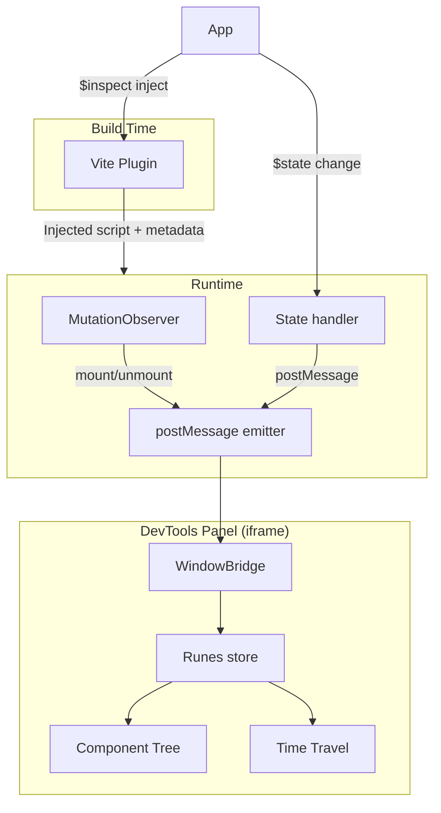

# Svelte DevTools Documentation

Full-stack debugging for Svelte 5 and SvelteKit applications, built on [Vite DevTools Kit](https://github.com/vitejs/devtools).

## Overview

Svelte DevTools provides real-time component inspection, state tracking, timeline visualization, time-travel debugging, network tracing, and migration scoring for Svelte 5 applications. It integrates directly with the Vite dev server for an integrated debugging experience (Chromium is the tested browser) — no browser extension required.

## Features

- **Component Tree**: Visualize your Svelte component hierarchy with parent-child relationships, search, and click-to-select
- **State Inspection**: Track `$state`, `$derived`, `$props`, and `$effect` in real time (destructuring, defaults, `$bindable()` supported)
- **Element Inspector**: Hover-mode overlay that highlights Svelte components on the page
- **Time Travel**: Record state snapshots, undo/redo, restore across SvelteKit routes
- **Timeline**: Chronological event history (mounts, updates, effects, network) with filters
- **Component Graph**: Force-directed graph of the component hierarchy
- **Network Tracing**: Browser fetch calls and mock rules in the panel; SSR traces with `routeId` through HTTP/MCP. See the [current server display limitation](05_server.md#client-display).
- **Router Inspector**: SvelteKit route inventory from the resolved routes directory
- **Migration Scoring**: Svelte 4 → 5 migration analysis per file
- **Agent Access**: MCP inspection and acknowledged state edits plus authenticated HTTP endpoints. Runtime data requires an open Svelte panel.
- **Zero Production Impact**: All dev tools code is dev-only (`apply: 'serve'`)

## Architecture

The system uses **build-time `$inspect` injection** for state tracking and **postMessage** for event-driven UI updates:


```mermaid
flowchart TB
    subgraph Build["Build Time"]
        VP["Vite Plugin"]
    end

    subgraph Runtime["Runtime"]
        MO["MutationObserver"]
        PM["postMessage emitter"]
        RS["State handler"]
    end

    subgraph UI["DevTools Panel (iframe)"]
        WB["WindowBridge"]
        Store["Runes store"]
        CT["Component Tree"]
        TT["Time Travel"]
    end

    App -->|"$inspect inject"| VP
    VP -->|"Injected script + metadata"| Runtime
    App -->|"$state change"| RS
    MO -->|"mount/unmount"| PM
    RS -->|"postMessage"| PM
    PM --> WB
    WB --> Store
    Store --> CT
    Store --> TT
```

## Quick Start

### 1. Install the Plugin

Follow the [source installation steps](02_vite-plugin.md#installation) for GitHub release 0.2.0. Build the checkout, then use the fixture or install the built local plugin directory into your project. The 0.2.x packages are not published to npm.

### 2. Configure Vite

**Plain Vite:**

```typescript
// vite.config.ts
import { defineConfig } from 'vite';
import { DevTools } from '@vitejs/devtools';
import { svelte } from '@sveltejs/vite-plugin-svelte';
import { svelteDevTools } from '@fsodano/vite-plugin-svelte-devtools';

export default defineConfig({
  plugins: [DevTools(), svelte(), svelteDevTools()]
});
```

**SvelteKit:**

```typescript
// vite.config.ts
import { defineConfig } from 'vite';
import { sveltekit } from '@sveltejs/kit/vite';
import { DevTools } from '@vitejs/devtools';
import { svelteDevTools } from '@fsodano/vite-plugin-svelte-devtools';

export default defineConfig({
  plugins: [DevTools(), sveltekit(), svelteDevTools()]
});

// src/hooks.server.ts
import { dev } from '$app/environment';
import type { Handle } from '@sveltejs/kit';
import { svelteDevToolsHandle, noopHandle } from '@fsodano/vite-plugin-svelte-devtools/sveltekit';

export const handle: Handle = dev ? svelteDevToolsHandle() : noopHandle();
```

### 3. Start Development

```bash
npm run dev
```

### 4. Open DevTools

1. Look for the **Vite** floating overlay button in the bottom-right corner of your page
2. Click it to open the Vite DevTools panel (authorize with the token printed in the server terminal)
3. Select the **Svelte** tab from the dock
4. View your component tree, state, timeline, and time-travel console

## Documentation Structure

| # | Document | Description |
|---|----------|-------------|
| 1 | [Architecture](./01_architecture.md) | System design, data flow, and key decisions |
| 2 | [Vite Plugin](./02_vite-plugin.md) | Build-time transforms, configuration, HTTP API |
| 3 | [Runtime](./03_runtime.md) | $inspect handling, component detection, postMessage protocol |
| 4 | [Client UI](./04_client.md) | DevTools panel implementation and stores |
| 5 | [Server Integration](./05_server.md) | SvelteKit request tracing |
| 6 | [API Reference](./06_api.md) | Public API and type definitions |
| — | [Vite 8 Guide](./VITE.md) | Vite 8 / Rolldown internals for plugin development |
| — | [Agent MCP](./07_mcp.md) | Setup, tools, and runtime data limits |
| — | [Completion plan](./plans/pending/devtools-completion.md) | Current discrepancies and verification status |
| — | [Inspiration](./inspiration.md) | Vue DevTools feature comparison |
| — | [ADR](./adr/README.md) | Architecture Decision Records and historical context |

## Package Structure

```
packages/
├── vite-plugin/       - Build-time transforms, SvelteKit hooks, server tracing, HTTP API
├── runtime/           - Browser runtime: state handling, component registry, inspector
├── client/            - DevTools panel UI (iframe, served from dist/)
├── mcp/               - Stdio MCP adapter over the HTTP API
└── types/             - Shared TypeScript types and constants
```

## How It Works

### Build Time

The Vite plugin transforms each `.svelte` file during development:

1. **Component Registration**: Injects a registry entry with a unique mounted-instance ID derived from file metadata and `$props.id()`
2. **Data Attributes**: Adds `data-svelte-devtools-id` and `data-svelte-component` to the root element
3. **$inspect Injection**: Wraps `$state`, `$derived`, `$props` declarations with `$inspect` hooks
4. **Effect Tracking**: Instruments `$effect` / `$effect.pre` callbacks

### Runtime

**Runtime Package** (`window.__SVELTE_DEVTOOLS_RUNTIME__`):
1. **Receives State**: `$inspect` callbacks call `runtime.handleState()`
2. **Detects Components**: Transformed registration tracks mounted instances; a `MutationObserver` correlates `data-svelte-devtools-id` attributes with DOM elements
3. **Emits Events**: Uses `postMessage` for real-time updates
4. **Exposes API**: `window.__SVELTE_DEVTOOLS_RUNTIME__` and `window.__SVELTE_DEVTOOLS__`

### DevTools Panel

The iframe-based UI (Svelte 5, runes stores):

1. **Listens to Events**: Receives `postMessage` from the runtime via a window bridge
2. **Displays Tree**: Hierarchical component view with search
3. **Shows State**: Real-time state inspection with full reactivity
4. **Time Travel**: Captures snapshots (while recording), restores via registered setters

## Why $inspect Injection?

Svelte 5's runes (`$state`, `$derived`, `$effect`) are **compile-time transforms**, not runtime functions. They don't exist as global objects that can be hooked at runtime. The only way to track state changes is to use `$inspect`, which is Svelte 5's public API for observing state.

| Approach | Works with Svelte 5? |
|----------|---------------------|
| Runtime rune hooking | ❌ Runes don't exist at runtime |
| `$inspect` injection | ✅ Uses public Svelte API |
| DOM scanning | ✅ But fragile and slow |

**Decision**: Use `$inspect` injection for reliable, official state tracking.

## Browser Support

- Chromium-based [tested]
- Safari [not tested]
- Firefox [not tested]

## License

MIT

## Current coverage

Instrumentation covers transformed component `.svelte` source. It does not instrument standalone `.svelte.ts` or `.svelte.js` rune modules or precompiled libraries. Migration results include files encountered by the transform, not a full-project audit. Browser mocks intercept client fetch requests; they do not mock SSR requests. The route endpoint is a filesystem inventory. It reads SvelteKit plugin configuration when available and otherwise uses `src/routes`. Route groups and parameter metadata are preserved. Dynamic templates require concrete parameter values before navigation. See the [completion plan](./plans/pending/devtools-completion.md) before relying on broad feature claims.
