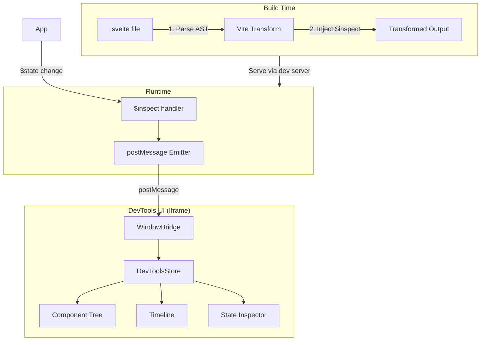
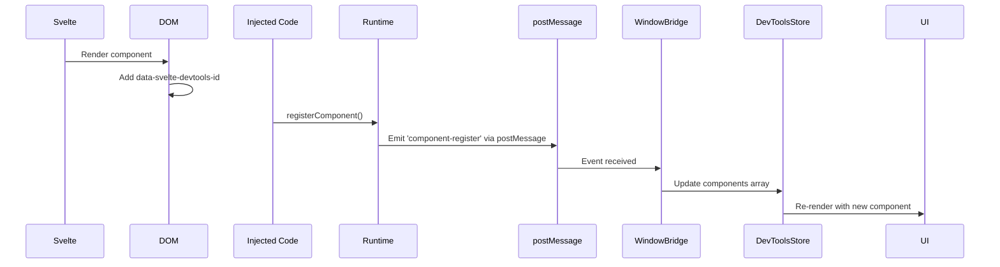
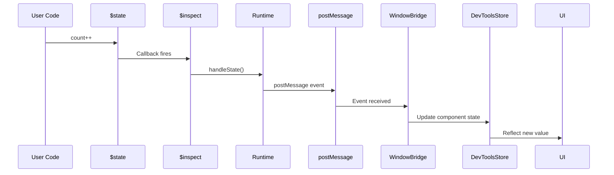

# Architecture Overview

This document describes the high-level architecture of Svelte DevTools, including system design, data flow, and key architectural decisions.

## System Design

Svelte DevTools is a Vite plugin that integrates with `@vitejs/devtools-kit` to provide real-time debugging for Svelte 5 applications.

### Core Philosophy

The architecture follows a **build-time $inspect injection + runtime postMessage emission** pattern:

1. **Build Time**: Transform Svelte files to inject `$inspect` hooks and component metadata
2. **Runtime**: Receive state changes via injected hooks, emit events via `postMessage` 
3. **UI**: Display data in an isolated iframe via postMessage communication

## Data Flow



## Key Components

### 1. Vite Plugin (`packages/vite-plugin`)

**Responsibilities:**
- Transform Svelte files during compilation
- Inject component metadata and `$inspect` hooks
- Register DevTools dock with `@vitejs/devtools-kit`
- Serve runtime and client assets

### 2. Runtime (`packages/runtime`)

**Responsibilities:**
- Run in the main app context (injected by plugin)
- Receive state changes via `handleState()` calls
- Track component state in memory
- Emit events via `postMessage`
- Expose `window.__SVELTE_DEVTOOLS_RUNTIME__` API


### 3. Client UI (`packages/client`)

**Responsibilities:**
- Run in isolated iframe (`/__svelte-devtools/`)
- Listen to runtime events via WindowBridge
- Display component tree, timeline, and state
- Handle user interactions (selection, filtering)

### 4. WindowBridge (`packages/client/src/lib/bridge`)

**Responsibilities:**
- Bridge communication between iframe and parent window
- Listen to `postMessage` events from runtime
- Emit events to store listeners

**Why postMessage?**

The runtime emits events via `postMessage` for cross-iframe communication:
- Works across same-origin iframes
- No polling needed for state changes - they arrive via postMessage
- Simple implementation with `window.addEventListener('message', ...)`
- Clean separation of concerns

## Event Flow

### Component Mount



### State Change



## State Management

### Component Registry

The registry tracks all components and their metadata:

1. **Build-time Registration** (`__SVELTE_DEVTOOLS_REGISTRY__`)
   - Map of component ID to metadata
   - Injected by Vite plugin
   - Populated as components load

2. **Runtime State** (`window.__SVELTE_DEVTOOLS_RUNTIME__`)
   - Active runtime instance
   - Receives state changes via `handleState()`
   - Emits events via `postMessage`

### $inspect Injection

State values are tracked via `$inspect`:

```typescript
// Injected by Vite plugin
let count = $state(0);
// Becomes:
let count = $state(0);
$inspect(count).with((type, value) => {
  window.__SVELTE_DEVTOOLS_RUNTIME__.handleState('component-id', 'count', type, value);
});
```

## Serialization

Values must be serialized for cross-context communication. The runtime handles:
- Circular references
- Functions (shown as `[Function: name]`)
- Spring/Tween instances (extract `current`, `target`)
- Proxies (unwrap to plain objects)

## Design Decisions

### Why Vite DevTools Kit?

Svelte DevTools is built as a Vite plugin that integrates with `@vitejs/devtools-kit`, serving the UI in an iframe at `/__svelte-devtools/`. This approach provides:

- **Built into dev server** — no separate installation required
- **Simple iframe communication** — uses postMessage between app and DevTools panel
- **Full Vite integration** — leverages Vite's transform pipeline and middleware
- **Immediate updates** — changes ship with the plugin, no store approval needed

### Why $inspect Injection Instead of Runtime Rune Hooking?

| Runtime Rune Hooking | $inspect Injection |
|---------------------|-------------------|
| ❌ Runes are compile-time transforms | ✅ Uses public Svelte API |
| ❌ `window.svelte` doesn't exist in Svelte 5 | ✅ Works with any Svelte 5 app |
| ❌ Would require modifying Svelte internals | ✅ Official, stable API |

**Decision**: Use `$inspect` injection because Svelte 5 runes don't exist at runtime - they're compile-time syntax transforms.

### Why postMessage Instead of Polling?

| Polling | postMessage |
|---------|-------------|
| 100ms delay | Real-time updates |
| CPU overhead from constant checks | Zero overhead when idle |
| Can miss rapid changes | Captures every change |
| Simple implementation | Clean architecture |

**Decision**: Use postMessage for event-driven communication. State changes are sent immediately via postMessage, providing real-time updates without polling overhead.

## Performance Considerations

1. **Build Time**: Transforms happen once per file, cached by Vite
2. **Runtime Overhead**:
   - `$inspect` callback: Minimal, synchronous
   - Event emission: `postMessage` is fast
   - Memory: Component state stored in Maps
3. **UI**: Svelte 5 reactivity ensures minimal DOM updates

## Security

- All runtime code is dev-only (`apply: 'serve'`)
- Iframe runs same-origin as app (no cross-origin issues)
- No eval() or dynamic code execution

## Future Architecture

Potential improvements:

1. **WebSocket RPC**: Replace postMessage with bidirectional communication
2. **Time-Travel**: State snapshots for rewinding
3. **Server Integration**: Full SvelteKit server-side tracing
4. **Build Mode**: Static DevTools for production debugging
