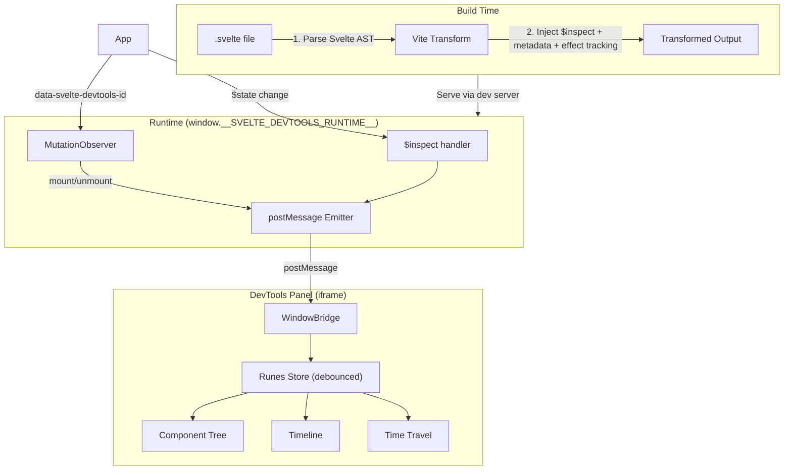
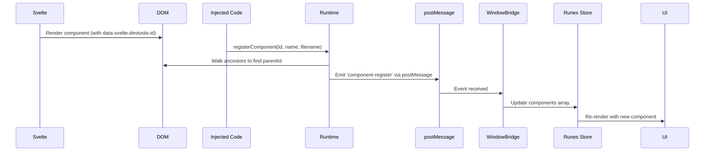
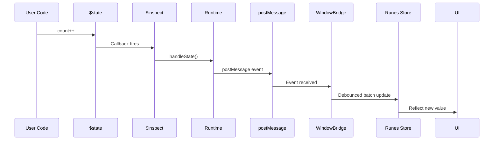

# Architecture Overview

This document describes the high-level architecture of Svelte DevTools, including system design, data flow, and key architectural decisions.

## System Design

Svelte DevTools is a Vite plugin that integrates with `@vitejs/devtools-kit` to provide real-time debugging for Svelte 5 applications.

### Core Philosophy

The architecture follows a **build-time $inspect injection + runtime postMessage emission** pattern:

1. **Build Time**: Transform Svelte files to inject `$inspect` hooks and component metadata
2. **Runtime**: Receive state changes via injected hooks, track registered component instances with a DOM-observer fallback, emit events via `postMessage`
3. **UI**: Display data in a DevTools panel iframe via a postMessage window bridge backed by Svelte 5 runes stores

## Data Flow


```mermaid
flowchart TB
    subgraph Build["Build Time"]
        SF[".svelte file"] -->|"1. Parse Svelte AST"| VT["Vite Transform"]
        VT -->|"2. Inject $inspect + metadata + effect tracking"| TO["Transformed Output"]
    end

    subgraph Runtime["Runtime (window.__SVELTE_DEVTOOLS_RUNTIME__)"]
        HS["$inspect handler"]
        MO["MutationObserver"]
        PM["postMessage Emitter"]
    end

    subgraph UI["DevTools Panel (iframe)"]
        WB["WindowBridge"]
        Store["Runes Store (debounced)"]
        CT["Component Tree"]
        TL["Timeline"]
        TT["Time Travel"]
    end

    Build -->|"Serve via dev server"| Runtime
    App -->|"$state change"| HS
    App -->|"data-svelte-devtools-id"| MO
    MO -->|"mount/unmount"| PM
    HS --> PM
    PM -->|"postMessage"| WB
    WB --> Store
    Store --> CT
    Store --> TL
    Store --> TT
```

## Key Components

### 1. Vite Plugin (`packages/vite-plugin`)

A single plugin object (`name: 'svelte-devtools'`, `apply: 'serve'`, `enforce: 'pre'`):

**Responsibilities:**
- Transform Svelte files during compilation (inject `$inspect` hooks, component metadata, `$effect` tracking)
- Register the DevTools dock and RPC methods with `@vitejs/devtools-kit`
- Serve runtime script, client UI, and HTTP API endpoints via middleware
- Trace server requests (SvelteKit handle + generic middleware)
- Scan SvelteKit routes and analyze Svelte 4→5 migration scores

### 2. Runtime (`packages/runtime`)

**Responsibilities:**
- Run in the main app context (loaded as a script tag injected into the HTML)
- Receive state changes via `handleState()` from injected `$inspect` hooks
- Track component mount/unmount through transformed registration and `onDestroy`; correlate DOM elements with a `MutationObserver` on `data-svelte-devtools-id`
- Track component state, props (via `propKeys` metadata), and effects in memory
- Intercept `window.fetch` to emit `client:request` traces
- Emit events via `postMessage`
- Expose `window.__SVELTE_DEVTOOLS_RUNTIME__` and `window.__SVELTE_DEVTOOLS__` APIs
- Register per-key state setters (`_registerState`) so the panel can write values back into live runes

### 3. Client UI (`packages/client`)

**Responsibilities:**
- Run in an iframe served from `/__svelte-devtools/` (pre-built from `client/dist/`)
- Listen to runtime events via a window bridge
- Display 10 tabs: Info, Components, Events, Time Travel, Graph, Network, Router, Assets, Migrate, Settings
- Handle user interactions (selection, filtering, inspect mode, snapshot restore, go-to-source)

### 4. WindowBridge (`packages/client/src/lib/bridge`)

**Responsibilities:**
- Bridge communication between the iframe and the parent window
- Listen to `postMessage` events from the runtime (filter `data.source === 'svelte-devtools'`)
- Map runtime event types to bridge event types (`mapRuntimeEventTypeToBridge`)
- Poll `window.parent.__SVELTE_DEVTOOLS__.getAllComponents()` every 500ms as a reconciliation fallback
- Emit events to store listeners

**Why postMessage?**

The runtime emits events via `postMessage` for cross-iframe communication:
- Works across same-origin iframes
- No polling needed for state changes - they arrive via postMessage
- Simple implementation with `window.addEventListener('message', ...)`
- Clean separation of concerns

## Event Flow

### Component Mount


```mermaid
sequenceDiagram
    participant S as Svelte
    participant DOM as DOM
    participant Inj as Injected Code
    participant Runtime as Runtime
    participant PM as postMessage
    participant WB as WindowBridge
    participant Store as Runes Store
    participant UI as UI

    S->>DOM: Render component (with data-svelte-devtools-id)
    Inj->>Runtime: registerComponent(id, name, filename)
    Runtime->>DOM: Walk ancestors to find parentId
    Runtime->>PM: Emit 'component-register' via postMessage
    PM->>WB: Event received
    WB->>Store: Update components array
    Store->>UI: Re-render with new component
```

### State Change


```mermaid
sequenceDiagram
    participant UC as User Code
    participant State as $state
    participant Inspect as $inspect
    participant Runtime as Runtime
    participant PM as postMessage
    participant WB as WindowBridge
    participant Store as Runes Store
    participant UI as UI

    UC->>State: count++
    State->>Inspect: Callback fires
    Inspect->>Runtime: handleState()
    Runtime->>PM: postMessage event
    PM->>WB: Event received
    WB->>Store: Debounced batch update
    Store->>UI: Reflect new value
```

## State Management

### Component Registry

The runtime tracks all components in a `Map<string, ComponentState>`:

1. **Build-time Metadata** (`window.__SVELTE_DEVTOOLS_REGISTRY__`)
   - `Map<id, {id, name, filename, propKeys}>` injected by the Vite plugin
   - Used by the runtime for prop detection and mount attribution

2. **Runtime State** (`window.__SVELTE_DEVTOOLS_RUNTIME__`)
   - Active runtime instance
   - Receives state changes via `handleState()`
   - Emits events via `postMessage`

3. **Client Cache** (server-side `/api/sync`)
   - The panel POSTs its component/timeline/snapshot state to `/__svelte-devtools/api/sync` every 2s
   - Enables the HTTP API and AI agents to query runtime state without the browser

### $inspect Injection

State values are tracked via `$inspect`:

```typescript
// Injected by Vite plugin after each rune declaration
let count = $state(0);
// Becomes:
let count = $state(0);
$inspect(count).with((t, ...v) => {
  window.__SVELTE_DEVTOOLS_RUNTIME__.handleState('component-id', 'count', t, v[0]);
});
```

A per-key setter is also registered (`_registerState`) so the Time Travel panel can restore values directly into the live rune.

## Serialization

Values must be serialized for cross-context communication. The runtime's `sanitizeForPostMessage` handles:
- Circular references (walk with a `seen` set)
- Functions (shown as `[Function]`)
- DOM nodes (shown as `[DOM Node]`)
- Maps → plain objects, Sets → arrays
- Getters (invoked in try/catch)
- Spring/Tween instances (extract `current`, `target` — handled at the store level via the motion gate)

## Design Decisions

### Why Vite DevTools Kit?

Svelte DevTools is built as a Vite plugin that integrates with `@vitejs/devtools-kit`, registering a dock (iframe panel at `/__svelte-devtools/`). This approach provides:

- **Built into dev server** — no separate installation required
- **Iframe panel** — same-origin, simple postMessage communication
- **Full Vite integration** — leverages Vite's transform pipeline and middleware
- **RPC + logs** — `ctx.rpc` for agent methods, `ctx.logs` for notifications

### Why $inspect Injection Instead of Runtime Rune Hooking?

| Runtime Rune Hooking | $inspect Injection |
|---------------------|-------------------|
| ❌ Runes are compile-time transforms | ✅ Uses public Svelte API |
| ❌ `window.svelte` doesn't exist in Svelte 5 | ✅ Works with any Svelte 5 app |
| ❌ Would require modifying Svelte internals | ✅ Official, stable API |

**Decision**: Use `$inspect` injection because Svelte 5 runes don't exist at runtime - they're compile-time syntax transforms.

### Why postMessage Instead of Polling?

| Polling | postMessage |
|---------|-------------|
| 100ms delay | Real-time updates |
| CPU overhead from constant checks | Zero overhead when idle |
| Can miss rapid changes | Captures every change |
| Simple implementation | Clean architecture |

**Decision**: Use postMessage for event-driven communication. State changes are sent immediately via postMessage, providing real-time updates without polling overhead. (A 500ms `getAllComponents()` poll exists only as a reconciliation fallback for initial component discovery.)

### Why Debounce on the Client?

`$inspect` fires synchronously for every state assignment. Rapid bursts (image loads, animation frames) would otherwise rebuild the components array for every single event. The client store:
1. Queues incoming state changes
2. Flushes on a timer, collapsing to the **latest value per (componentId, key)**
3. Applies all values in a single immutable pass + batch timeline entries (capped at 1000)

See [ADR-0002](./adr/ADR-0002-debounced-state-change-batching.md).

## Performance Considerations

1. **Build Time**: Transforms happen once per file, cached by Vite
2. **Runtime Overhead**:
   - `$inspect` callback: minimal, synchronous
   - Event emission: `postMessage` is fast
   - Component detection: registration hooks and a MutationObserver fallback; no component polling
   - Memory: component state stored in Maps
3. **UI**: Debounced state batching + Svelte 5 reactivity ensure minimal DOM updates

## Security

- All runtime code is dev-only (`apply: 'serve'`)
- The panel iframe runs same-origin as the app (no cross-origin issues)
- No `eval()` or dynamic code execution
- `/api/source` rejects paths outside the project root (403)

## Implemented & Future

Implemented:
1. ✅ Time-Travel debugging (snapshot capture/restore, undo/redo, cross-route)
2. ✅ Server-side request tracing (SvelteKit handle + Vite middleware)
3. ✅ Component graph visualization
4. ✅ Router inspector (SvelteKit route scan)
5. ✅ Element inspector (hover overlay + click-to-select)
6. ✅ Browser `fetch` mock rules (native XMLHttpRequest is preserved)

Future ideas:
1. 🚧 Server trace display repair and database observability. See [current server boundaries](05_server.md#current-boundaries).
2. 🚧 Server-side mocking. Browser fetch mocking is implemented; server requests pass through.
