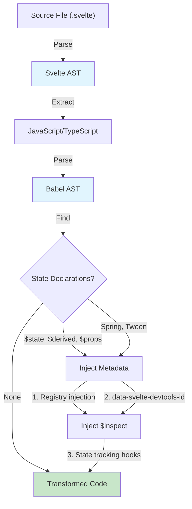

# Vite Plugin

The Vite plugin is the build-time entry point for Svelte DevTools. It transforms Svelte components to inject metadata and state tracking.

## Installation

### Development (Local)

Since this package is not yet published to npm, install via workspace or link:

```bash
# From the monorepo root
npm install

# Or link the package
cd packages/vite-plugin
npm link
# Then in your project:
npm link @svelte-devtools/vite-plugin
```

### Production (Published)

```bash
npm install @svelte-devtools/vite-plugin
```

## Usage

### Basic Setup

```typescript
// vite.config.ts
import { defineConfig } from 'vite';
import { sveltekit } from '@sveltejs/kit/vite';
import { svelteDevTools } from '@svelte-devtools/vite-plugin';

export default defineConfig({
  plugins: [
    sveltekit(),
    svelteDevTools()
  ]
});
```

### With Options

```typescript
svelteDevTools({
  // Enable state inspection via $inspect injection (default: true)
  enableStateInspection: true,

  // File patterns to include (default: [/\.svelte$/])
  include: [/\.svelte$/],

  // File patterns to exclude (default: [/node_modules/])
  exclude: [/node_modules/, /\.test\.svelte$/]
});
```

## How It Works

### Transform Pipeline



### 1. Component ID Generation

Each Svelte component gets a stable ID based on its file path:

```typescript
function getStableId(id: string, root: string): string {
  const relPath = path.relative(root, id);
  let hash = 0;
  for (let i = 0; i < relPath.length; i++) {
    hash = ((hash << 5) - hash) + relPath.charCodeAt(i);
    hash |= 0;
  }
  return `svt-${Math.abs(hash).toString(36)}`;
}
```

This ensures:
- Same ID across reloads for the same file
- Different IDs for different files
- Short, URL-safe identifiers

### 2. Component Metadata Injection

The plugin injects registration code at the start of each component's script:

```javascript
// Injected code
if (typeof window !== 'undefined') {
  window.__SVELTE_DEVTOOLS_REGISTRY__ ||= new Map();
  window.__SVELTE_DEVTOOLS_REGISTRY__.set('svt-abc123', {
    id: 'svt-abc123',
    name: 'Counter',
    filename: '/src/lib/Counter.svelte'
  });
}
```

### 3. Data Attribute Injection

The first non-void HTML element gets a data attribute for DOM correlation:

```svelte
<!-- Before -->
<div class="counter">
  <button>Click</button>
</div>

<!-- After -->
<div data-svelte-devtools-id="svt-abc123" class="counter">
  <button>Click</button>
</div>
```

Elements skipped:
- `script`, `style`, `title`, `meta`, `link`, `base`
- Svelte special elements (`svelte:*`)

### 4. State Inspection Injection

For each `$state`, `$derived`, or `$props` declaration, inject `$inspect`:

```javascript
// Before
let count = $state(0);
let doubled = $derived(count * 2);
let { name } = $props();

// After
let count = $state(0);
$inspect(count).with((t, ...v) => {
  if (typeof window !== 'undefined' && window.__SVELTE_DEVTOOLS_RUNTIME__) {
    window.__SVELTE_DEVTOOLS_RUNTIME__.handleState('svt-abc123', 'count', t, v[0]);
  }
});

let doubled = $derived(count * 2);
$inspect(doubled).with((t, ...v) => {
  if (typeof window !== 'undefined' && window.__SVELTE_DEVTOOLS_RUNTIME__) {
    window.__SVELTE_DEVTOOLS_RUNTIME__.handleState('svt-abc123', 'doubled', t, v[0]);
  }
});

let { name } = $props();
$inspect(name).with((t, ...v) => {
  if (typeof window !== 'undefined' && window.__SVELTE_DEVTOOLS_RUNTIME__) {
    window.__SVELTE_DEVTOOLS_RUNTIME__.handleState('svt-abc123', 'name', t, v[0]);
  }
});
```

### 5. Spring/Tween Support

For motion classes, additional properties are tracked:

```javascript
// Before
let spring = new Spring(0);

// After
let spring = new Spring(0);
$effect(() => {
  const s = spring;
  if (typeof window !== 'undefined' && window.__SVELTE_DEVTOOLS_RUNTIME__ && window.__SVELTE_DEVTOOLS_RUNTIME__.handleState) {
    window.__SVELTE_DEVTOOLS_RUNTIME__.handleState('svt-abc123', 'spring', 'update', { current: s?.current, target: s?.target, stiffness: s?.stiffness, damping: s?.damping });
  }
});
```

## DevTools Kit Integration

### Dock Registration

The plugin registers with `@vitejs/devtools`:

```typescript
devtools: {
  setup(ctx) {
    ctx.docks.register({
      id: 'svelte-devtools',
      title: 'Svelte',
      icon: 'simple-icons:svelte',
      type: 'iframe',
      url: '/__svelte-devtools/'
    });
  }
}
```

This creates a "Svelte" tab in the Vite DevTools dock.

### Middleware Setup

The plugin serves three types of content:

1. **Client UI** (`/__svelte-devtools/*`): The DevTools panel HTML/JS/CSS
2. **Runtime** (`/__svelte-devtools/svelte-runtime.js`): The runtime script
3. **vite-inject.js** (`/__svelte-devtools/vite-inject.js`): Vite DevTools injection

```typescript
configureServer(server) {
  const clientPath = path.resolve(__dirname, '../../client/dist');
  const distPath = path.resolve(__dirname, '../../../dist');

  server.middlewares.use('/__svelte-devtools', (req, res, next) => {
    // Serve runtime script
    // Serve vite-inject.js for Vite DevTools
    // Serve client UI from client/dist/ (SPA fallback)
  });
}
```

### HTML Injection

The plugin injects the runtime script into the HTML:

```typescript
transformIndexHtml(html) {
  return html.replace(
    '</head>',
    `<script type="module" src="/__svelte-devtools/svelte-runtime.js"></script></head>`
  );
}
```

## Transform Implementation

### AST Parsing

Uses `@babel/parser` for JavaScript/TypeScript:

```typescript
function parseJavaScript(code: string): t.File | null {
  try {
    return parseJS(code, {
      sourceType: 'module',
      plugins: ['typescript', 'jsx']
    });
  } catch {
    return null;
  }
}
```

### MagicString Usage

Uses `magic-string` for source map preservation:

```typescript
const s = new MagicString(code);

// Inject at specific position
s.appendLeft(position, injectedCode);

// Generate source map
const map = s.generateMap({ hires: true });

return { code: s.toString(), map };
```

### State Declaration Detection

Traverses AST to find rune declarations:

```typescript
function findStateDeclarations(ast: t.File, offset: number): StateDeclaration[] {
  const result: StateDeclaration[] = [];

  t.traverse(ast, {
    enter(node) {
      if (!t.isVariableDeclaration(node)) return;

      for (const decl of node.declarations) {
        if (!decl.init) continue;

        // Check for $state, $derived, $props
        extractStateDeclaration(decl, offset, result);

        // Check for new Spring(), new Tween()
        extractMotionDeclaration(decl, offset, result);

        // Check for destructured $props
        extractPropsDeclaration(decl, offset, result);
      }
    }
  });

  return result;
}
```

## Configuration Options

```typescript
interface SvelteDevToolsPluginOptions {
  /** Enable state inspection via $inspect injection (default: true) */
  enableStateInspection?: boolean;

  /** File patterns to include (default: [/\.svelte$/]) */
  include?: RegExp[];

  /** File patterns to exclude (default: [/node_modules/]) */
  exclude?: RegExp[];
}
```

## Troubleshooting

### "Unknown entry" Error

**Problem**: Wrong structure for dock registration.

**Fix**: Ensure flat structure (not nested `view` object):

```typescript
// WRONG
ctx.docks.register({
  id: 'svelte-devtools',
  view: { type: 'iframe', src: '/__svelte-devtools' }  // NESTED
});

// CORRECT
ctx.docks.register({
  id: 'svelte-devtools',
  title: 'Svelte',
  icon: 'simple-icons:svelte',
  type: 'iframe',
  url: '/__svelte-devtools/'
});
```

### SvelteKit vs Plain Vite

**Problem**: `transformIndexHtml` not working with SvelteKit SSR.

**Solution**: For SvelteKit, inject via `hooks.server.ts`:

```typescript
export const handle = async ({ event, resolve }) => {
  return resolve(event, {
    transformPageChunk: ({ html }) => {
      return html.replace('</head>',
        `<script src="/__svelte-devtools/svelte-runtime.js"></script></head>`
      );
    }
  });
};
```

### Generated Files

Files in `.svelte-kit/generated/` are automatically skipped:

```typescript
if (/\.svelte-kit\/generated/.test(id)) return null;
```

## Production Safety

The plugin has `apply: 'serve'` which means it only runs in development:

```typescript
export function svelteDevTools(options = {}): Plugin {
  return {
    name: 'svelte-devtools-pro',  // Dev only
    apply: 'serve',
    enforce: 'pre',
    // ...
  };
}
```

All injected code includes `typeof window !== 'undefined'` guards for SSR safety.
