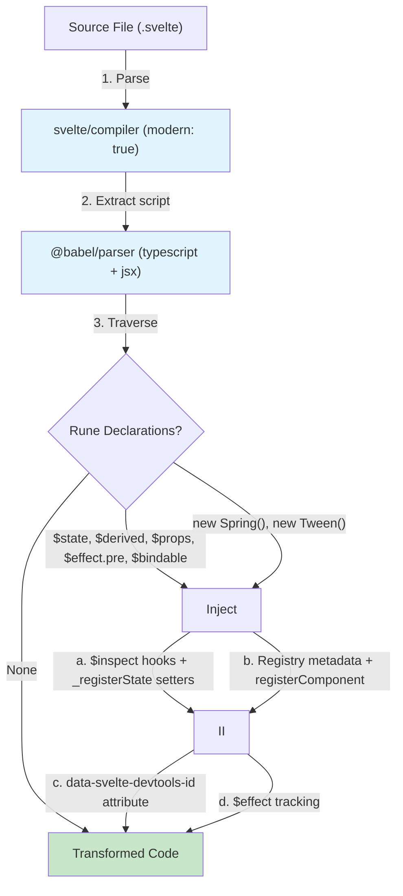

# Vite Plugin

The Vite plugin (`packages/vite-plugin`) is the build-time entry point for Svelte DevTools. It transforms Svelte components to inject metadata and state tracking, registers the DevTools dock with `@vitejs/devtools-kit`, and serves the runtime, client UI, and HTTP API during development.

> **Implementation note**: `svelteDevTools()` returns a **single** Vite plugin object (`name: 'svelte-devtools'`, `apply: 'serve'`, `enforce: 'pre'`). The `src/plugins/` subdirectory (configure, transform, static-serve, devtools-setup, virtual-runtime, optimizer) is an **unwired, dead-code refactor** — do not document it as active. All live logic lives in `src/index.ts`, with support modules `sveltekit.ts`, `server-api.ts`, `server-events.ts`, and `migration-analyzer.ts`.

## Installation

### Development (Local)

Since this package is not yet published to npm, install via workspace or link:

```bash
# From the monorepo root
npm install

# Or link the package
cd packages/vite-plugin
npm link
# Then in your project:
npm link @fsodano/vite-plugin-svelte-devtools
```

### Production (Published)

```bash
npm install -D @fsodano/vite-plugin-svelte-devtools @vitejs/devtools
```

## Usage

### Basic Setup (Plain Vite)

```typescript
// vite.config.ts
import { defineConfig } from 'vite';
import { DevTools } from '@vitejs/devtools';
import { svelte } from '@sveltejs/vite-plugin-svelte';
import { svelteDevTools } from '@fsodano/vite-plugin-svelte-devtools';

export default defineConfig({
  plugins: [
    DevTools(),
    svelte(),
    svelteDevTools()
  ]
});
```

### SvelteKit

```typescript
// vite.config.ts
import { defineConfig } from 'vite';
import { sveltekit } from '@sveltejs/kit/vite';
import { DevTools } from '@vitejs/devtools';
import { svelteDevTools } from '@fsodano/vite-plugin-svelte-devtools';

export default defineConfig({
  plugins: [DevTools(), sveltekit(), svelteDevTools()]
});

// src/hooks.server.ts
import { dev } from '$app/environment';
import type { Handle } from '@sveltejs/kit';
import { svelteDevToolsHandle, noopHandle } from '@fsodano/vite-plugin-svelte-devtools/sveltekit';

export const handle: Handle = dev ? svelteDevToolsHandle() : noopHandle();
```

**Order matters**: `DevTools()` (the host panel) first, then the Svelte/SvelteKit plugin, then `svelteDevTools()`.

### With Options

```typescript
svelteDevTools({
  // File patterns to include (default: [/\.svelte$/])
  include: [/\.svelte$/],

  // File patterns to exclude (default: [/node_modules/])
  exclude: [/node_modules/, /\.test\.svelte$/],

  // Reserved: enable state inspection (default: true).
  // Accepted for API compatibility; injection currently always runs.
  enableStateInspection: true
});
```

## How It Works

### Transform Pipeline

The `transform` hook (index.ts:490-544) processes each matching `.svelte` file in four passes:


```mermaid
flowchart TB
    SF["Source File (.svelte)"] -->|"1. Parse"| SA["svelte/compiler (modern: true)"]
    SA -->|"2. Extract script"| BABEL["@babel/parser (typescript + jsx)"]
    BABEL -->|"3. Traverse"| SD{"Rune Declarations?"}

    SD -->|"$state, $derived, $props, $effect.pre, $bindable"| IM["Inject"]
    SD -->|"new Spring(), new Tween()"| IM
    SD -->|"None"| TC["Transformed Code"]

    IM -->|"a. $inspect hooks + _registerState setters"| II
    IM -->|"b. Registry metadata + registerComponent"| II
    II -->|"c. data-svelte-devtools-id attribute"| TC
    II -->|"d. $effect tracking"| TC

    style SA fill:#e1f5fe
    style BABEL fill:#e1f5fe
    style TC fill:#c8e6c9
```

### 1. Component ID Generation

Each Svelte component gets a stable ID based on its file path (`svt-<hash36>`):

```typescript
function getStableId(id: string, root: string): string {
  const relPath = path.relative(root, id);
  let hash = 0;
  for (let i = 0; i < relPath.length; i++) {
    hash = ((hash << 5) - hash) + relPath.charCodeAt(i);
    hash |= 0;
  }
  return `svt-${Math.abs(hash).toString(36)}`;
}
```

This ensures:
- Same ID across reloads for the same file
- Different IDs for different files
- Short, URL-safe identifiers

### 2. Component Metadata Injection

The plugin injects registration code at the start of each component's `<script>` block (`injectComponentMetadata`, index.ts:563-583):

```javascript
// Injected code
if (typeof window !== 'undefined') {
  window.__SVELTE_DEVTOOLS_REGISTRY__ ||= new Map();
  window.__SVELTE_DEVTOOLS_REGISTRY__.set('svt-abc123', {
    id: 'svt-abc123', name: 'Counter',
    filename: '/src/lib/Counter.svelte', propKeys: ["name"]
  });
}
if (typeof window !== 'undefined' && window.__SVELTE_DEVTOOLS_RUNTIME__) {
  window.__SVELTE_DEVTOOLS_RUNTIME__.registerComponent('svt-abc123', 'Counter', '/src/lib/Counter.svelte');
}
```

### 3. Data Attribute Injection

The first meaningful HTML element gets data attributes for DOM correlation:

```svelte
<!-- Before -->
<div class="counter">
  <button>Click</button>
</div>

<!-- After -->
<div data-svelte-devtools-id="svt-abc123" data-svelte-component="Counter" class="counter">
  <button>Click</button>
</div>
```

Elements skipped: `script`, `style`, `title`, `meta`, `link`, `base`, and Svelte special elements (`svelte:*`).

### 4. State Inspection Injection

For each `$state`, `$derived`, or `$props` declaration, inject `$inspect` + a setter (`injectStateInspection`, index.ts:585-603; `createInjectCode`, index.ts:648-659):

```javascript
// Before
let count = $state(0);
let doubled = $derived(count * 2);
let { name } = $props();

// After
let count = $state(0);
if (typeof window !== 'undefined' && window.__SVELTE_DEVTOOLS_RUNTIME__ && window.__SVELTE_DEVTOOLS_RUNTIME__._registerState) {
  window.__SVELTE_DEVTOOLS_RUNTIME__._registerState('svt-abc123', 'count', (v) => { count = v; });
}
$inspect(count).with((t, ...v) => {
  if (typeof window !== 'undefined' && window.__SVELTE_DEVTOOLS_RUNTIME__ && window.__SVELTE_DEVTOOLS_RUNTIME__.handleState) {
    window.__SVELTE_DEVTOOLS_RUNTIME__.handleState('svt-abc123', 'count', t, v[0]);
  }
});
```

Supported patterns (`extractRuneDeclarations`, index.ts:689-766):
- Simple: `let count = $state(0)`
- Object destructuring: `let { x, y } = $state({ x: 0, y: 0 })`
- Array destructuring: `let [first, ...rest] = $state([])`
- Default values: `let { name = 'default' } = $props()`
- Renamed keys: `let { user: name } = $props()`
- Bindable: `let { x = $bindable() } = $props()`

Notes:
- `$derived` declared with `const` gets no setter (assigning to a const would throw in SSR) — index.ts:654
- `untrack` and `$host` are counted but never injected — index.ts:709
- `$state.snapshot()` / `$state.fsync()` are counted (index.ts:816-829)

### 5. Spring/Tween (Motion) Support

For `new Spring(...)` / `new Tween(...)` declarations (`extractMotionDeclaration`, index.ts:852-864), an `$effect` tracks `current`/`target`/`stiffness`/`damping` and registers a hard-setter:

```javascript
let spring = new Spring(0);
// Injected:
$effect(() => {
  const s = spring;
  window.__SVELTE_DEVTOOLS_RUNTIME__.handleState('svt-abc123', 'spring', 'update',
    { current: s?.current, target: s?.target, stiffness: s?.stiffness, damping: s?.damping });
});
```

### 6. Effect Tracking

Standalone `$effect()` / `$effect.pre()` call sites get a `handleEffect` call injected at the top of the callback body (`injectEffectTracking`, index.ts:768-850). The runtime records run counts and a snapshot of observed state.

### 7. Migration Analysis

Each transformed file is scored by `analyzeMigration` (migration-analyzer.ts): 11 weighted Svelte 4 patterns (`export let`, `$:` reactive statements, `on:click`, `createEventDispatcher`, stores, `<slot>`, lifecycle functions, etc.). Components below 50% trigger a `svelte-migration` warning log.

## DevTools Kit Integration

### Dock Registration

The plugin registers with `@vitejs/devtools` via the `devtools.setup` hook (index.ts:373-382), using `DOCK_CONFIG` from `@svelte-devtools/types`:

```typescript
devtools: {
  setup(ctx: ViteDevToolsNodeContext) {
    ctx.docks.register({
      id: 'svelte-devtools',
      title: 'Svelte',
      icon: 'simple-icons:svelte',
      type: 'iframe',
      url: '/__svelte-devtools/'
    });
  }
}
```

This creates a "Svelte" tab (an iframe pointing at the panel URL) in the Vite DevTools dock.

### RPC Methods (live)

Six RPC methods are registered in `devtools.setup` (index.ts:385-464):

| Method | Type | Description |
|---|---|---|
| `svelte-devtools:get-components` | query | All registered `ComponentMeta` entries |
| `svelte-devtools:open-in-editor` | mutation | Open a file at a line (`launch-editor`) |
| `svelte-devtools:migration-score` | query | `{overall, totalFiles, perFile}` |
| `svelte-devtools:build-status` | query | `{connected, totalComponents, trackedRunes, errors, warnings}` |
| `svelte-devtools:component-state` | query | Metadata for one `svt-*` id (`NOT_FOUND` error otherwise) |
| `svelte-devtools:rescan` | mutation | Triggers a `full-reload` |

> `RPC_METHODS` in `@svelte-devtools/types` also defines `get-timeline`, `get-state`, `update-component-state`, `set-network-rule`, and `get-routes`, but those are **not registered** by the live plugin yet.

### Logs API

The plugin uses `ctx.logs.add(...)` (index.ts:467-478) for notifications (init message, transform errors, per-component migration warnings, and a debounced 2s registration summary).

## Middleware Setup (configureServer)

The plugin serves several types of content (index.ts:134-365):

1. **Generic request tracer** — captures URL, method, status, duration, headers, and response preview for every non-asset, non-devtools request (index.ts:181-254)
2. **`/__svelte-devtools/server-events`** — `GET` (supports `?last=N` and `?sinceId=X`) / `DELETE` (index.ts:256-284)
3. **`/__svelte-devtools/open-in-editor`** — `POST {file, line, column}` → `launchEditor` (index.ts:286-312)
4. **`/__svelte-devtools/migration-score`** — `GET` (index.ts:314-329)
5. **`/__svelte-devtools/api/*`** — delegated to `server-api.ts` (index.ts:332-336)
6. **`/__svelte-devtools/svelte-runtime.js`** — the runtime bundle from `runtime/dist/index.js` (index.ts:343-351)
7. **Static assets + client SPA** — `sirv(clientPath, {dev: true, single: true})` fallback (index.ts:338-360)

### HTML Injection

The plugin injects the runtime script into the HTML via `transformIndexHtml` (index.ts:367-370) — **plain Vite only**:

```typescript
transformIndexHtml(html: string) {
  const runtimeScript = `<script type="module" src="/__svelte-devtools/svelte-runtime.js"></script>`;
  return html.replace('</head>', `${runtimeScript}</head>`);
}
```

### SvelteKit `$app/navigation` Interception

For cross-route time travel, the plugin rewrites `$app/navigation` to a virtual module exposing the real `goto` on `window.__SVELTE_DEVTOOLS_REAL_GOTO__` (index.ts:55-81). SvelteKit calls `goto` from the panel iframe directly, bypassing SvelteKit's navigation guard during snapshot restore.

### tsconfig Path Aliases

In `configResolved`, the plugin reads `tsconfig.json` `compilerOptions.paths` and pushes them into `config.resolve.alias` (index.ts:96-119) so SvelteKit `$lib`/`@/`-style aliases resolve correctly during transforms.

## HTTP API Endpoints

All endpoints under `/__svelte-devtools/api/` return JSON with CORS headers (see `server-api.ts`):

| Method | Endpoint | Description |
|---|---|---|
| `GET` | `/api/` or `/api/status` | Plugin status, version, endpoint list |
| `GET` | `/api/components` | Cached components + state (synced from panel) |
| `GET` | `/api/timeline` | Cached timeline entries |
| `GET` | `/api/remote` | Remote-debugging payload |
| `GET` | `/api/server-events` | Server request traces (`?last=N`, `?sinceId=X`) |
| `DELETE` | `/api/server-events` | Clear server event buffer |
| `GET` | `/api/migration` | `{overall, totalFiles, perFile}` |
| `GET` | `/api/snapshots` | Snapshot branch tree (`parentId`, `branchId`) |
| `POST` | `/api/set-state` | `{componentId, key, value}` — edit cached state |
| `GET` | `/api/source?file=<path>` | Source code with line numbers (403 outside project) |
| `POST` | `/api/sync` | (internal) Panel syncs state here every 2s |
| `GET` | `/api/routes` | SvelteKit route map scanned from `src/routes` |

## SvelteKit Integration

SvelteKit bypasses Vite's `transformIndexHtml` during SSR. The `svelteDevToolsHandle()` helper (in `@fsodano/vite-plugin-svelte-devtools/sveltekit`, see sveltekit.ts) solves this by injecting both the Vite DevTools client script and the Svelte runtime script via `transformPageChunk` on every server-rendered response. It also:

- Installs a `globalThis.fetch` interceptor at module load (so SvelteKit load functions are traced as `server:request` events)
- Traces SSR responses as `server:ssr` / `server:error` with `event.route.id`, status, headers, and JSON response previews
- `noopHandle()` is a zero-overhead pass-through for production

The plugin logs the exact `hooks.server.ts` snippet when it detects SvelteKit (debug mode only, index.ts:121-131).

### Generated Files

Files in `.svelte-kit/generated/` are automatically skipped in the transform:

```typescript
if (/\.svelte-kit\/generated/.test(id)) return null;
```

## Configuration Options

Defined in `@svelte-devtools/types` (`SvelteDevToolsPluginOptions`):

```typescript
interface SvelteDevToolsPluginOptions {
  /** File patterns to include (default: [/\.svelte$/]) */
  include?: RegExp[];

  /** File patterns to exclude (default: [/node_modules/]) */
  exclude?: RegExp[];

  /** Reserved: enable state inspection via $inspect injection (default: true).
   *  Currently a no-op — injection always runs. */
  enableStateInspection?: boolean;
}
```

## Troubleshooting

### "Unknown entry" Error

**Problem**: Wrong structure for dock registration.

**Fix**: Ensure flat structure (not nested `view` object):

```typescript
// WRONG
ctx.docks.register({ id: 'svelte-devtools', view: { type: 'iframe', src: '/__svelte-devtools' } });

// CORRECT
ctx.docks.register({ id: 'svelte-devtools', title: 'Svelte', icon: 'simple-icons:svelte', type: 'iframe', url: '/__svelte-devtools/' });
```

### SvelteKit vs Plain Vite

**Problem**: `transformIndexHtml` does not fire with SvelteKit SSR.

**Solution**: Use the exported `svelteDevToolsHandle` helper in `hooks.server.ts` (see above). The handle injects both the Vite DevTools client injection script and the Svelte runtime script via `transformPageChunk` on every server-rendered response.

### Panel is blank (plain Vite)

**Problem**: Client UI bundle missing or stale.

**Fix**: Rebuild the client from the monorepo: `npm run build:client` (or `npm run build`), then restart the dev server. The panel is served from `packages/client/dist/`, not compiled on demand.

## Production Safety

The plugin has `apply: 'serve'`, so it only runs in development:

```typescript
export function svelteDevTools(options: SvelteDevToolsPluginOptions = {}): Plugin {
  return {
    name: 'svelte-devtools',  // Dev only
    apply: 'serve',
    enforce: 'pre',
    // ...
  };
}
```

All injected code includes `typeof window !== 'undefined'` guards for SSR safety.
