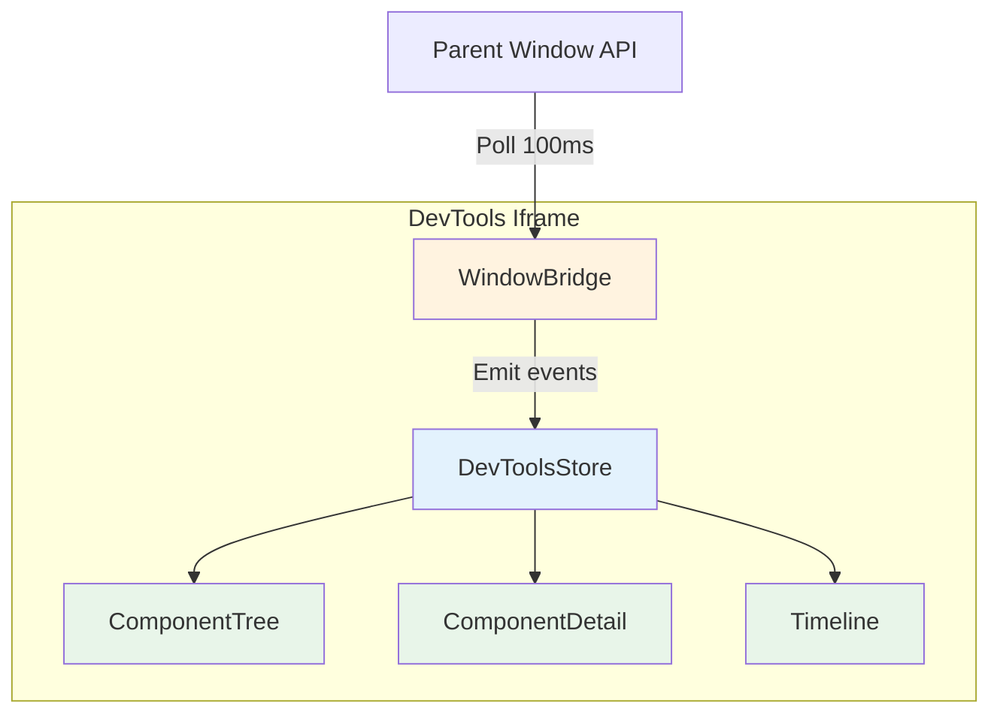

# Client UI

The client is the DevTools UI that runs in an iframe, displaying the component tree, state, and timeline.

## Architecture



## Entry Point

`main.ts` initializes the app using Svelte 5's `mount` API:

```typescript
import { mount } from 'svelte';
import App from './App.svelte';
import { devtoolsStore } from './lib/stores/devtools-store.svelte.ts';

function init() {
  const target = document.getElementById('app');
  if (!target) return;

  devtoolsStore.init();
  mount(App, { target });
}

if (document.readyState === 'loading') {
  document.addEventListener('DOMContentLoaded', init);
} else {
  init();
}
```

## Window Bridge

The bridge handles communication with the parent window (main app) via postMessage and polling.

### Implementation

```typescript
export function createWindowBridge() {
  const listeners = new Map<string, Set<BridgeHandler>>();

  if (typeof window !== 'undefined') {
    const targetWindow = window.parent !== window ? window.parent : window;

    targetWindow.addEventListener('message', (event) => {
      const data = event.data;
      if (!data || data.source !== 'svelte-devtools') return;

      const callbacks = listeners.get(data.type);
      if (callbacks) {
        const mappedPayload = mapPostMessagePayload(data.payload, data.type);
        callbacks.forEach(fn => {
          try { fn(mappedPayload); }
          catch (e) { console.error('[Bridge] postMessage listener error:', e); }
        });
      }
    });

    if (window.parent && window.parent !== window) {
      const parentWindow = window.parent as WindowWithDevTools;
      const mountedComponents = new Set<string>();

      const syncComponents = () => {
        const parentApi = parentWindow.__SVELTE_DEVTOOLS__;
        if (!parentApi) return;

        const components = parentApi.getAllComponents?.() || [];

        components.forEach((comp) => {
          if (!mountedComponents.has(comp.id)) {
            mountedComponents.add(comp.id);
            const callbacks = listeners.get('component:mount');
            callbacks?.forEach(fn => fn({
              id: comp.id,
              name: comp.name,
              state: Object.fromEntries(comp.state || []),
              children: comp.children || [],
              parentId: comp.parentId,
              filename: comp.filename
            }));
          }
        });
      };

      let connected = false;
      const connectInterval = setInterval(() => {
        if (parentWindow.__SVELTE_DEVTOOLS__) {
          connected = true;
          clearInterval(connectInterval);
          syncComponents();
        }
      }, 100);

      setTimeout(() => clearInterval(connectInterval), 5000);
      if (connected) syncComponents();

      setInterval(syncComponents, 100);
    }
  }

  return {
    on(type: string, fn: BridgeHandler) {
      if (!listeners.has(type)) listeners.set(type, new Set());
      listeners.get(type)!.add(fn);
      return () => listeners.get(type)!.delete(fn);
    }
  };
}
```

### Why postMessage + Polling?

1. **Event-based**: State changes arrive via postMessage immediately when they occur
2. **Polling fallback**: Used for initial component discovery (polling registry)
3. **Cross-iframe**: postMessage works reliably across iframe boundaries

## DevTools Store

A Svelte 5 runes-based store:

```typescript
function createDevtoolsStore() {
  let components = $state<ComponentNode[]>([]);
  let selectedComponentId = $state<string | null>(null);
  let timeline = $state<TimelineEntry[]>([]);
  let isConnected = $state(false);
  const bridge = createWindowBridge();

  function init(): void {
    bridge.on('component:mount', handleComponentMount);
    bridge.on('component:unmount', handleComponentUnmount);
    bridge.on('state:change', handleStateChange);
    bridge.on('effect:run', handleEffectRun);
    isConnected = true;
  }

  function handleComponentMount(payload: ComponentMountPayload): void {
    const node = ensureComponentNode(payload);
    const index = components.findIndex(c => c.id === node.id);

    if (index !== -1) {
      components[index] = node;
    } else {
      components = [...components, node];
    }

    addToTimeline({
      id: generateId(),
      type: 'component:mount',
      timestamp: performance.now(),
      data: node
    });
  }

  function handleStateChange(data: StateChangePayload): void {
    const existing = components.find(c => c.id === data.componentId);
    if (!existing) return;  // Don't create on state change

    components = components.map(c => {
      if (c.id === data.componentId) {
        return { ...c, state: { ...c.state, [data.key]: data.value } };
      }
      return c;
    });

    addToTimeline({
      id: generateId(),
      type: 'state:change',
      timestamp: performance.now(),
      data
    });
  }

  return {
    get components() { return components; },
    get selectedComponentId() { return selectedComponentId; },
    get timeline() { return timeline; },
    get isConnected() { return isConnected; },
    init,
    selectComponent
  };
}

export const devtoolsStore = createDevtoolsStore();
```

## UI Components

### App.svelte

Root layout with sidebar navigation:

```svelte
<script lang="ts">
  import Sidebar from "./components/Sidebar.svelte";
  import ComponentTree from "./components/ComponentTree.svelte";
  import ComponentDetail from "./components/ComponentDetail.svelte";
  import Timeline from "./components/Timeline.svelte";
  import ServerView from "./components/ServerView.svelte";
  import { devtoolsStore } from "./lib/stores/devtools-store.svelte";

  let activeTab = $state("components");
  let selectedComponent = $state<string | null>(null);

  const components = $derived(devtoolsStore.components);
  const isConnected = $derived(devtoolsStore.isConnected);
</script>

<div class="panel">
  <div class="status-bar">
    <span class={isConnected ? "connected" : "disconnected"}>
      {isConnected ? "● Connected" : "● Disconnected"}
    </span>
    <span>{components.length} components</span>
  </div>

  <div class="main">
    <Sidebar bind:activeTab />
    <div class="content">
      {#if activeTab === "components"}
        <div class="split-view">
          <ComponentTree
            {components}
            onSelect={(id) => (selectedComponent = id)}
            selectedId={selectedComponent}
          />
          {#if selectedComponent}
            <ComponentDetail componentId={selectedComponent} />
          {:else}
            <div class="empty">
              {components.length === 0
                ? "No components found. Is this a Svelte page?"
                : "Select a component"}
            </div>
          {/if}
        </div>
      {:else if activeTab === "timeline"}
        <Timeline />
      {:else if activeTab === "server"}
        <ServerView />
      {/if}
    </div>
  </div>
</div>
```

### ComponentTree

Displays hierarchical component structure:

```svelte
<script lang="ts">
  let { components, selectedId, onSelect } = $props();

  function getRootComponents(): ComponentNode[] {
    return components.filter(c => !c.parentId);
  }

  function getChildren(parentId: string): ComponentNode[] {
    return components.filter(c => c.parentId === parentId);
  }
</script>

<div class="tree">
  {#each getRootComponents() as component}
    <TreeNode
      {component}
      {selectedId}
      {onSelect}
      {getChildren}
    />
  {/each}
</div>
```

### ComponentDetail

Shows props, state, and source info for selected component:

```svelte
<script lang="ts">
  let { componentId } = $props();

  const component = $derived(
    devtoolsStore.components.find(c => c.id === componentId)
  );
</script>

<div class="detail">
  {#if component}
    <h3>{component.name}</h3>

    <section>
      <h4>State</h4>
      <pre>{JSON.stringify(component.state, null, 2)}</pre>
    </section>

    {#if component.filename}
      <section>
        <h4>Source</h4>
        <code>{component.filename}</code>
      </section>
    {/if}
  {/if}
</div>
```

### Timeline

Event history with filtering:

```svelte
<script lang="ts">
  const timeline = $derived(devtoolsStore.timeline);
  let filter = $state('');

  const filteredEvents = $derived(
    timeline.filter(e =>
      filter === '' || e.type.includes(filter)
    )
  );
</script>

<div class="timeline">
  <div class="filters">
    <button onclick={() => filter = ''}>All</button>
    <button onclick={() => filter = 'mount'}>Mounts</button>
    <button onclick={() => filter = 'state'}>State</button>
  </div>

  <div class="events">
    {#each filteredEvents as event}
      <div class="event {event.type}">
        <span class="timestamp">
          {new Date(event.timestamp).toLocaleTimeString()}
        </span>
        <span class="type">{event.type}</span>
        <span class="data">{JSON.stringify(event.data)}</span>
      </div>
    {/each}
  </div>
</div>
```

## Styling

VS Code Dark theme-inspired:

```css
:root {
  --bg-primary: #1e1e1e;
  --bg-secondary: #252526;
  --bg-tertiary: #2d2d2d;
  --text-primary: #d4d4d4;
  --text-secondary: #858585;
  --accent: #0e639c;
  --success: #4ec9b0;
  --error: #f48771;
  --border: #3c3c3c;
}
```

## Build Configuration

Vite config with correct base path for iframe:

```typescript
// vite.config.ts
import { defineConfig } from 'vite';
import { svelte } from '@sveltejs/vite-plugin-svelte';

export default defineConfig({
  base: '/__svelte-devtools/',
  build: {
    outDir: 'dist',
    emptyOutDir: true
  },
  plugins: [svelte()]
});
```

The `base` path ensures assets load correctly within the iframe.

## Performance Considerations

1. **Memoization**: Derivations are cached where possible
2. **Event-driven updates**: State changes arrive via postMessage, not polling
3. **State Updates**: Only diff state for changed components
4. **Timeline Cap**: Maximum 1000 events stored
5. **Polling**: Used for initial component discovery (100ms interval)

## Event Types

The UI handles these event types:

| Event | Payload | Description |
|-------|---------|-------------|
| `component:mount` | `ComponentNode` | Component mounted |
| `component:unmount` | `{ id: string }` | Component unmounted |
| `state:change` | `{ componentId, key, value }` | State updated |
| `effect:run` | `{ duration?, dependencies? }` | Effect executed |
| `trace:trigger` | `{ componentId, stateKey, trigger }` | Dependency traced |

## Debugging

From the DevTools iframe console:

```javascript
// Access the store
import { devtoolsStore } from './lib/stores/devtools-store.svelte.ts';
console.log(devtoolsStore.components);
console.log(devtoolsStore.timeline);

// Check parent API
console.log(window.parent.__SVELTE_DEVTOOLS__);
```
