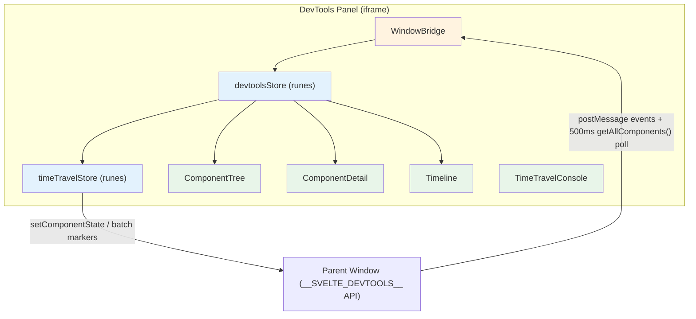

# Client UI

The client (`packages/client`) is the DevTools panel UI — a Svelte 5 app built with Vite and served from `dist/` at `/__svelte-devtools/` inside an iframe dock of the Vite DevTools panel.

> **Serving**: the panel is **pre-built** (`vite build` → `client/dist/`) and served statically by the Vite plugin. Changes to `packages/client/src/` require `npm run build:client` (or `npm run build`) plus a dev-server restart to take effect. The dock entry is configured with `type: 'iframe'` and `url: '/__svelte-devtools/'` (`DOCK_CONFIG` in `@fsodano/svelte-devtools-types`). Whether the Vite DevTools Kit renders that iframe in a popup window is the Kit's own behavior.

## Architecture


```mermaid
flowchart TB
    subgraph Panel["DevTools Panel (iframe)"]
        WB["WindowBridge"]
        Store["devtoolsStore (runes)"]
        TT["timeTravelStore (runes)"]
        CT["ComponentTree"]
        CD["ComponentDetail"]
        TL["Timeline"]
        TTC["TimeTravelConsole"]
    end

    Parent["Parent Window (__SVELTE_DEVTOOLS__ API)"]

    Parent -->|"postMessage events + 500ms getAllComponents() poll"| WB
    WB --> Store
    Store --> CT
    Store --> CD
    Store --> TL
    Store --> TT
    TT -->|"setComponentState / batch markers"| Parent

    classDef store fill:#e3f2fd
    classDef bridge fill:#fff3e0
    classDef component fill:#e8f5e9

    class Store,TT store
    class WB bridge
    class CT,CD,TL,TTC component
```

## Entry Point

`main.ts` initializes the app using Svelte 5's `mount` API:

```typescript
import { mount } from 'svelte';
import App from './App.svelte';
import { devtoolsStore } from './lib/stores/devtools-store.svelte.ts';

function init() {
  const target = document.getElementById('app');
  if (!target) return;
  devtoolsStore.init();
  mount(App, { target });
}

if (document.readyState === 'loading') {
  document.addEventListener('DOMContentLoaded', init);
} else {
  init();
}
```

> `src/panel.ts` is a legacy orphaned entry (mounts App without store init) — not wired into the build.

## Tabs

The sidebar (`Sidebar.svelte`) and shell (`App.svelte`) define **10 tabs**:

| Tab | Component | Purpose |
|-----|-----------|---------|
| Info | `Dashboard.svelte` | Connection status, versions, stat cards that navigate to tabs |
| Components | `ComponentTree.svelte` + `ComponentDetail.svelte` | Virtualized tree (searchable) + per-component Props/State/DOM/Source |
| Events | `Timeline.svelte` | Filtered event stream (All/Components/State/Effects/Server/Client Requests) with a JSON detail panel |
| Time Travel | `TimeTravelConsole.svelte` | Snapshot record/undo/redo/clear, snapshot list, diff detail panel |
| Graph | `ComponentGraph.svelte` | vis-network force-directed component graph |
| Network | `NetworkDesk.svelte` | SSR/error/client request list + Mock Rules editor |
| Router | `RouterHub.svelte` | SvelteKit route map from `/api/routes` with click-to-navigate |
| Assets | `Assets.svelte` | PerformanceResourceTiming resource list |
| Migrate | `MigrationScore.svelte` | Per-file Svelte 4→5 migration scores from `/api/migration` |
| Settings | `Settings.svelte` | Font scale, reduce motion, theme (localStorage) |

> `ServerView.svelte` exists in `src/components/` but is **dead code** — not imported by `App.svelte`.

## Window Bridge

The bridge (`src/lib/bridge/window-bridge.ts`) handles communication with the parent window (main app) via `postMessage` plus a reconciliation poll.

- Listens for `message` events filtered by `data.source === 'svelte-devtools'`
- Maps runtime event types to bridge types via `mapRuntimeEventTypeToBridge` (from `@fsodano/svelte-devtools-types`)
- Remaps payloads per type (`mapPostMessagePayload`)
- Polls `window.parent.__SVELTE_DEVTOOLS__.getAllComponents()` every 500ms (100ms connect interval, 5s timeout) to synthesize `component:mount` events for components missed by event push

## DevTools Store

A Svelte 5 runes store (`devtools-store.svelte.ts`) — module-level `$state` and exported singleton `devtoolsStore`:

```typescript
function createDevtoolsStore() {
  let components = $state<ComponentNode[]>([]);
  let selectedComponentId = $state<string | null>(null);
  let timeline = $state<TimelineEntry[]>([]);
  let isConnected = $state(false);
  let isRecording = $state(false);      // gates snapshot capture
  let isInspecting = $state(false);     // element inspector mode
  let serverEvents = $state<ServerEvent[]>([]);
  // ...
}
```

Key behaviors:
- **Debounced batching** — `pendingStateChanges` queue flushed on a timer; collapses to latest value per `(componentId, key)` and applies in one immutable pass (`flushStateChanges`)
- **Motion gate** — Spring/Tween frames dropped until `|current − target| < 0.0015` (SETTLE_TOLERANCE); duplicate settled frames skipped
- **Timeline cap** — max 1000 entries
- **Server events polling** — `/__svelte-devtools/server-events` every 1s
- **Server sync** — authenticated `fetch('/__svelte-devtools/api/sync', ...)` every 2s, with at most one request in flight, mirrors components/timeline/snapshots so the HTTP API can serve them
- **Bridge wiring** — `init()` registers handlers for `component:mount`, `component:unmount`, `state:change`, `trace:trigger`, `effect:run`, `client:request`, `inspect:toggle`, `inspect:select`

## Time Travel Store

A second runes store (`time-travel-store.svelte.ts`) holding snapshots:

```typescript
let snapshots = $state<StateSnapshot[]>([]);
let currentIndex = $state(-1);
let isTimeTravelMode = $state(false);
let maxSnapshots = $state(LIMITS.MAX_STATE_SNAPSHOTS); // 50
```

- **`capture(label?)`** — deep-clones components + timeline + `kitState` (URL); dedups against `lastRestoredSnapshotJSON` and the last capture; truncates future snapshots when capturing from the past; capped at 50
- **`restore(index, truncate?)`** — sets time-travel mode, stashes route state, temporarily hangs `window.fetch`, applies snapshot state via `parentApi.setComponentState` per key, restores timeline, and (cross-route) navigates via `window.__SVELTE_DEVTOOLS_REAL_GOTO__` or a synthetic `<a>` click, then polls for the route to mount
- **`undo()` / `redo()`** — restore `currentIndex ± 1`
- **`setStateEdit(componentId, key, value)`** — live-edit state and capture a `'state-edit'` snapshot
- **`branches`** — computed getter grouping snapshots by `branchId` (currently all `'main'`; the UI renders a flat list, not a branch grid)

Recording must be enabled for captures: the panel starts "Paused" and only records after the Record button is clicked.

## Key UI Components

### App.svelte

Shell with a status bar (brand, **inspect button**, Connected/Disconnected pill) and the sidebar. In inspect mode, the inspect button toggles `devtoolsStore.toggleInspector()`; the `inspect:select` bridge event switches to the Components tab and selects the component.

### ComponentTree / ComponentDetail

- Tree rows show name, filename, and render duration; search filters by name/filename/state keys/values
- Detail panel has Props / State / DOM / Source sub-tabs; State values render via `JsonTree`
- **Go to source**: clicking the `source-link` badge calls `openInEditor(filename, line)` (see below)

### Timeline

Filter chips (All / Components / State / Effects / Server / Client Requests), Clear button, and a resizable detail panel rendering the selected event payload with `JsonTree`.

### TimeTravelConsole

- **Record button** (`.record-btn`) toggles "Paused" ↔ "Recording" — snapshots are only captured while recording
- **Toolbar** (`.tb-btn`) — undo, redo, play, clear; snapshot counter `.count` shows `current / total`
- **Snapshot list** — rows with `.dot`/`.fill` indicators; clicking a row opens the 280px detail panel
- **Detail panel** — metadata + "Changes from previous snapshot" diff view (struck-through old value → arrow → new value), plus a "Restore this snapshot" button

### NetworkDesk

Request list (SSR traces, errors, client requests) + a Mock Rules editor that posts `{type: 'svelte-devtools-set-mock-rules', rules}` to the parent window.

### RouterHub

Fetches `/__svelte-devtools/api/routes` (filesystem scan of `src/routes`), renders route groups/params with badges, and navigates by posting `{type: 'svelte-devtools-navigate', url}` to the parent.

## Go to Source (Open in Editor)

`src/lib/open-in-editor.ts`:

```typescript
async function openInEditor(filename: string, line?: number, column?: number) {
  await fetch('/__svelte-devtools/open-in-editor', {
    method: 'POST',
    headers: { 'Content-Type': 'application/json' },
    body: JSON.stringify({ file: filename, line, column })
  });
}
```

The Vite plugin's `/__svelte-devtools/open-in-editor` middleware resolves the path against the project root and calls `launchEditor` (which opens VS Code or your configured editor).

## Styling

VS Code Dark theme-inspired CSS custom properties (`theme.css`):

```css
:root {
  --bg-base: #1e1e1e;
  --bg-sidebar: #252526;
  --bg-surface: #2d2d2d;
  --text-primary: #d4d4d4;
  --text-muted: #858585;
  --svelte-brand: #ff3e00;
  --border-default: #3c3c3c;
  /* ... */
}
```

## Build Configuration

```typescript
// vite.config.ts
import { defineConfig } from 'vite';
import { svelte } from '@sveltejs/vite-plugin-svelte';

export default defineConfig({
  base: '/__svelte-devtools/',
  build: {
    outDir: 'dist',
    emptyOutDir: true
  },
  plugins: [svelte()]
});
```

The `base` path ensures assets load correctly within the iframe.

## Communication Summary

| Direction | Mechanism |
|---|---|
| Runtime → Panel | `postMessage` (`{source: 'svelte-devtools', type, payload}`) |
| Panel → Runtime | Direct calls on `window.parent.__SVELTE_DEVTOOLS__` |
| Panel → Server | HTTP polling (server-events 1s) + authenticated fetch sync (2s, one request in flight) |
| Panel → Parent (app) | `postMessage` (navigate, mock rules) |
| Agent → Plugin | RPC (`ctx.rpc`) / HTTP API (`/__svelte-devtools/api/*`) |

## Event Types Handled

| Event | Payload | Description |
|-------|---------|-------------|
| `component:mount` | `ComponentNode` | Component mounted |
| `component:unmount` | `{ id, name? }` | Component unmounted |
| `state:change` | `{ componentId, key, value }` | State updated |
| `effect:run` | `{ runeName, filename, runCount, observedState }` | Effect executed |
| `trace:trigger` | `{ componentId, stateKey, trigger }` | Dependency traced / error |
| `client:request` | `{ url, method, statusCode, ... }` | Browser fetch traced |

## Debugging

From the DevTools panel iframe console:

```javascript
// Access the store
import { devtoolsStore } from './lib/stores/devtools-store.svelte.ts';
console.log(devtoolsStore.components);
console.log(devtoolsStore.timeline);

// Check parent API
console.log(window.parent.__SVELTE_DEVTOOLS__);
```
