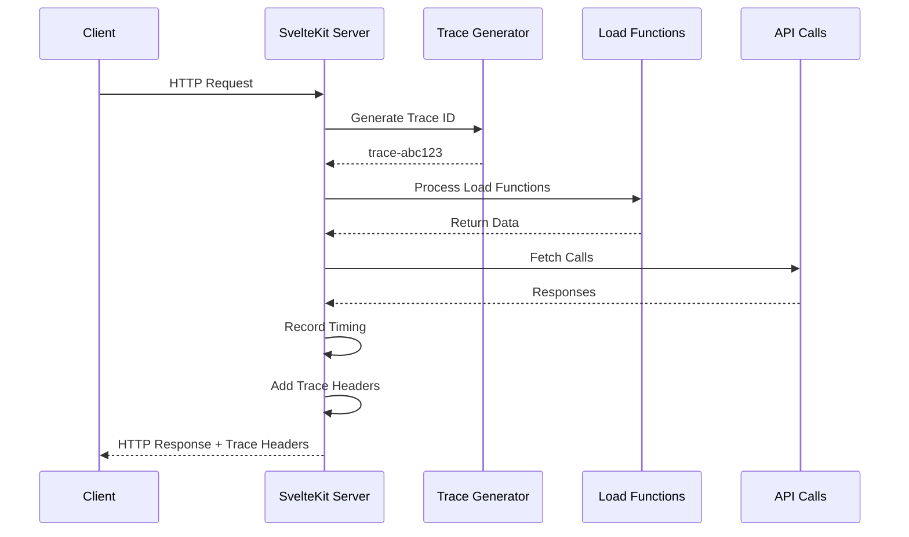

# Server Integration

**Status**: 🚧 Planned / Not Yet Implemented

SvelteKit server-side integration for tracing load functions, API calls, and data flow.

> **Warning**: This documentation describes planned functionality. The `packages/server/` directory and implementation do not yet exist.

## Overview

When implemented, the server package will provide SvelteKit `handle` integration to trace:
- Request lifecycle
- Load function timing
- API calls made during SSR
- Database queries (when instrumented)
- Server-to-client data correlation

## Installation

```bash
npm install @svelte-devtools/server
```

## Usage

### Basic Setup

```typescript
// src/hooks.server.ts
import { sveltekitDevtools } from '@svelte-devtools/server';

export const handle = sveltekitDevtools();
```

### With Custom Handle

```typescript
// src/hooks.server.ts
import { sveltekitDevtools } from '@svelte-devtools/server';
import { sequence } from '@sveltejs/kit/hooks';
import { auth } from './auth';

export const handle = sequence(
  auth,                           // Your auth handler
  sveltekitDevtools()            // DevTools tracing
);
```

### With Options

```typescript
import { sveltekitDevtools } from '@svelte-devtools/server';

export const handle = sveltekitDevtools({
  // Include trace headers in response (default: true)
  includeTraceHeaders: true,

  // Trace load functions (default: true)
  traceLoads: true,

  // Trace fetch calls (default: true)
  traceFetches: true
});
```

## How It Works

### Request Tracing



### Load Function Tracing

The handle wraps load functions to capture:
- Function name/file location
- Input parameters (sanitized)
- Return values (sanitized)
- Execution duration
- Errors (if any)

```typescript
// Server-side capture
{
  type: 'server:load',
  traceId: 'trace-abc123',
  route: '/src/routes/+page.ts',
  duration: 45,  // ms
  data: { /* sanitized return value */ },
  timestamp: 1234567890
}
```

### API Call Tracing

Fetch calls during SSR are intercepted:

```typescript
// Server-side capture
{
  type: 'api:call',
  traceId: 'trace-abc123',
  method: 'GET',
  url: '/api/users',
  status: 200,
  duration: 23,  // ms
  timestamp: 1234567890
}
```

## Trace Headers

Server-to-client correlation via headers:

```http
X-SvelteDevTools-Trace: trace-abc123
X-SvelteDevTools-Data: { /* compressed trace data */ }
```

The client uses these to:
1. Correlate client-side components with server loads
2. Display server-side timing in Timeline
3. Show load function return values

## Data Sanitization

By default, sensitive data is redacted:
- Passwords, tokens, secrets (by key name pattern)
- Credit card numbers (by format)
- Large binary data (truncated)

### Custom Sanitization

```typescript
import { sveltekitDevtools } from '@svelte-devtools/server';

export const handle = sveltekitDevtools({
  sanitize: (key: string, value: unknown) => {
    // Custom sanitization logic
    if (key.includes('secret')) return '[REDACTED]';
    if (typeof value === 'string' && value.length > 1000) {
      return value.slice(0, 100) + '... [truncated]';
    }
    return value;
  }
});
```

## Database Query Tracing

For database query tracing, instrument your DB client:

### Prisma Example

```typescript
import { PrismaClient } from '@prisma/client';
import { traceQuery } from '@svelte-devtools/server';

const prisma = new PrismaClient({
  log: [
    { emit: 'event', level: 'query' },
  ],
});

prisma.$on('query', (e) => {
  traceQuery({
    query: e.query,
    duration: e.duration,
    traceId: getCurrentTraceId() // From async context
  });
});
```

### PostgreSQL (pg) Example

```typescript
import { Pool } from 'pg';
import { traceQuery } from '@svelte-devtools/server';

const pool = new Pool();

const originalQuery = pool.query.bind(pool);
pool.query = async (...args) => {
  const start = performance.now();
  const result = await originalQuery(...args);
  const duration = performance.now() - start;

  traceQuery({
    query: args[0],
    duration,
    traceId: getCurrentTraceId()
  });

  return result;
};
```

## Event Types

Server-side events that flow to the client:

| Event | Payload | Description |
|-------|---------|-------------|
| `server:load` | `{ route, duration, data }` | Load function completed |
| `api:call` | `{ method, url, status, duration }` | Fetch during SSR |
| `db:query` | `{ query, duration }` | Database query executed |
| `server:error` | `{ message, stack? }` | Server error occurred |

## Client Display

In the DevTools UI, server events appear:

1. **Timeline**: Mixed with client events, color-coded (blue for server)
2. **Server View**: Dedicated tab showing load functions and API calls
3. **Component Detail**: Shows which server load provided props

## Security Considerations

1. **Headers Only in Dev**: Trace headers only added in development mode
2. **No Production Data**: Server package should not be imported in production builds
3. **Sanitization**: All data is sanitized before transmission
4. **Async Context**: Trace ID tracking uses AsyncLocalStorage (or polyfill)

## Troubleshooting

### "Cannot find module '@svelte-devtools/server'"

The server package must be built:

```bash
npm run build:server
```

### Trace headers not appearing

Check that you're in development mode:

```typescript
// hooks.server.ts
import { dev } from '$app/environment';
import { sveltekitDevtools } from '@svelte-devtools/server';

export const handle = dev ? sveltekitDevtools() : async ({ event, resolve }) => resolve(event);
```

### No server events in timeline

Ensure the trace ID is being passed through:

```javascript
// In browser console
fetch('/__svelte-devtools/server-events')
  .then(r => r.json())
  .then(console.log);  // Should show server events
```

## Implementation Status

**Note**: The server integration is currently experimental. Core functionality works but UI integration is incomplete.

Completed:
- ✅ Basic handle wrapper
- ✅ Trace ID generation
- ✅ Load function timing
- ✅ Trace headers

In Progress:
- 🚧 Full data serialization
- 🚧 Client-side display
- 🚧 Database query tracing
