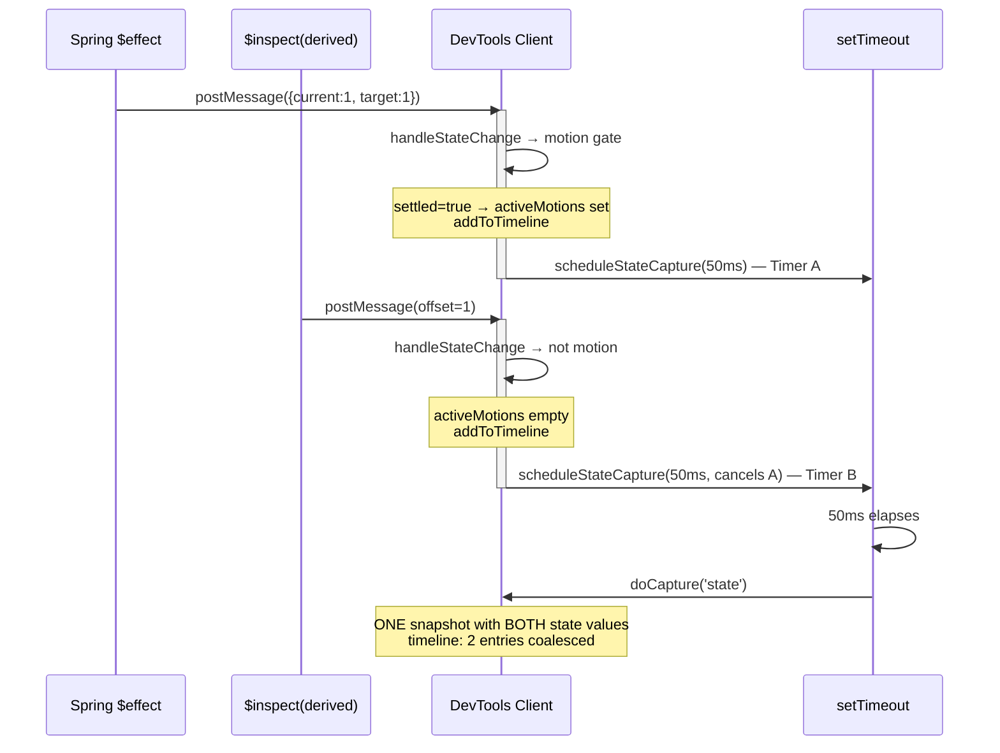
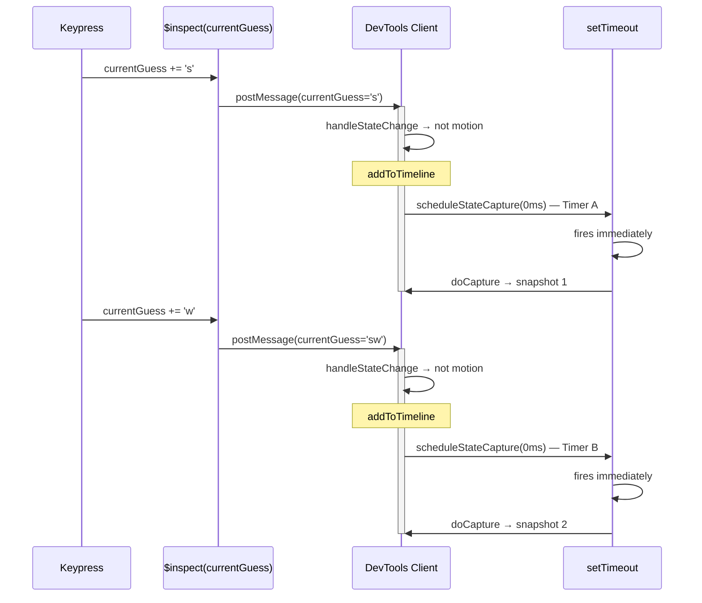
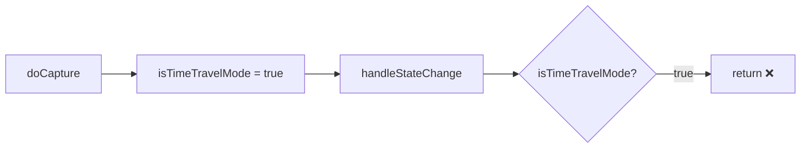
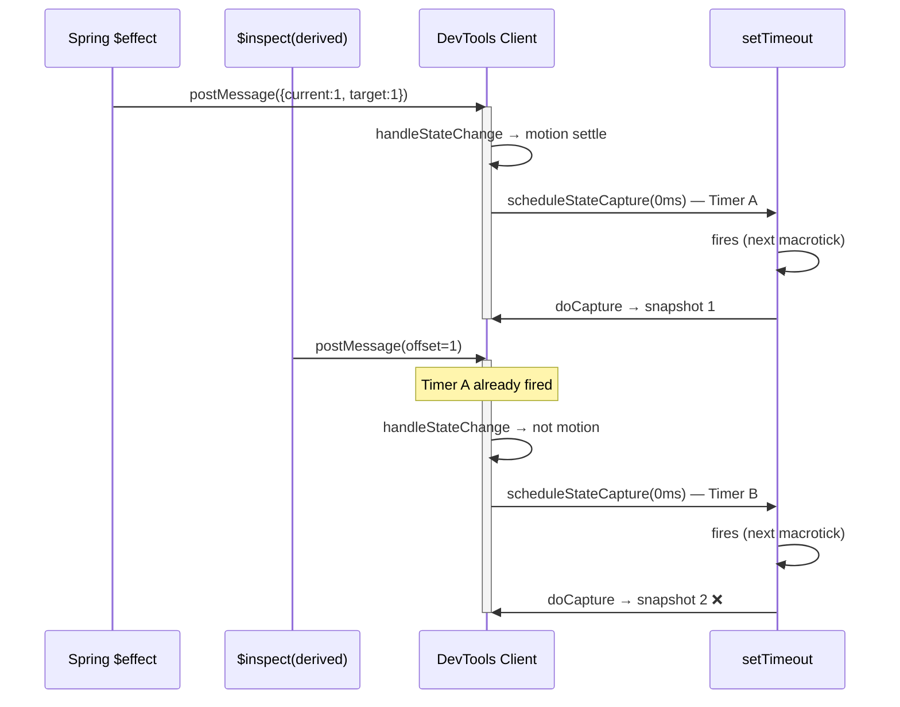
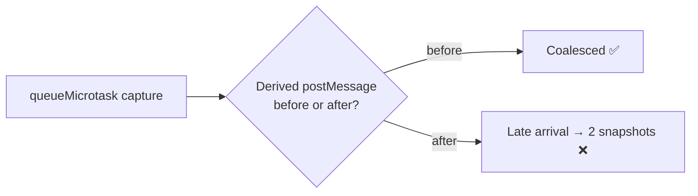
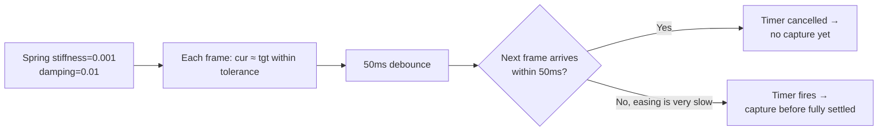
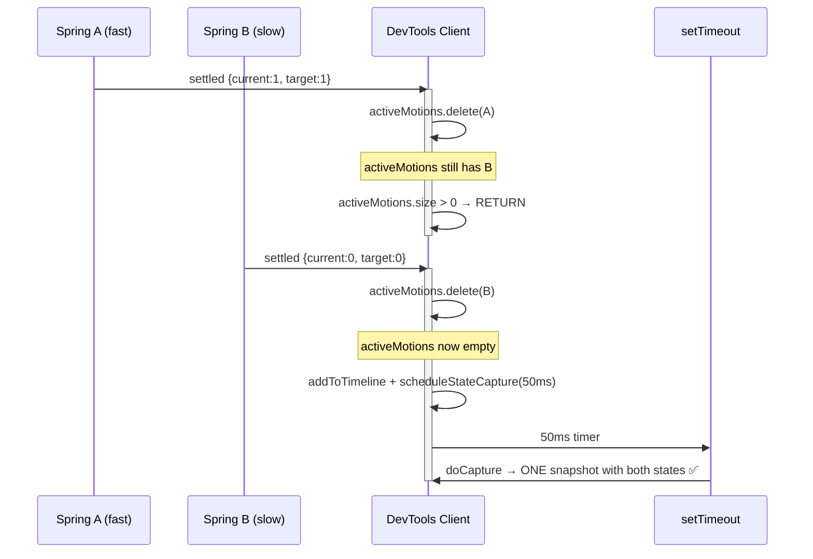

# ADR 001: Capture Debounce — Why 50ms

**Status**: Accepted  
**Date**: 2026-07-22  
**Author**: Sisyphus (Orchestration Agent)  
**PR**: [#4 — Sverdle timeline](https://github.com/fsodano/svelte-devtools/pull/4)

---

## Context

The DevTools captures component state changes and creates snapshots so users can time‑travel through the application's history. Each snapshot corresponds to a timeline entry — the user clicks a snapshot dot to restore that state.

When a **Spring** (or Tween) animation settles, Svelte 5 fires two related reactive callbacks within the same render cycle:

1.  **`$effect` watcher** (injected by the plugin) — fires with the Spring's `{current, target, stiffness, damping}` value.
2.  **`$inspect(derived)`** — fires for any `$derived` variable that depends on the Spring's `current` (e.g., `let offset = $derived(modulo(count.current, 1))`).

Both callbacks call `runtime.handleState()` → `window.postMessage()` → the DevTools client. The client's `handleStateChange()` adds a timeline entry and calls `scheduleStateCapture()`.

**The problem**: If each callback creates a separate snapshot, the timeline shows **two snapshots** for what the user perceives as a single state change (the Spring settled). One snapshot for the Spring's `{current, target}` and one for the derived value.

---

## Decision

Use a **50ms trailing‑edge debounce** in `scheduleStateCapture()` **only for motion‑settled frames** (Spring/Tween). Non‑motion state changes (regular `$state`/`$derived` typing) capture immediately at 0ms.

```typescript
// devtools-store.svelte.ts (simplified)
function scheduleStateCapture(label = 'state', delayMs = 0): void {
    if (stateCaptureTimer) clearTimeout(stateCaptureTimer);
    stateCaptureTimer = setTimeout(() => {
        if (isRecording && !isTimeTravelMode && activeMotions.size === 0) {
            timeTravel.doCapture(label);
        }
    }, delayMs);
}
```

Called from `handleStateChange()`:

```typescript
scheduleStateCapture('state', isMotion ? 50 : 0);
```

---

## Timing Diagram

### Normal Spring settle (default stiffness=0.15, damping=0.8)



### Sverdle typing (no motion)



---

## Alternatives Considered

### 1. `isTimeTravelMode = true` in `doCapture()` (rejected)

Setting `isTimeTravelMode = true` after `doCapture()` was intended to prevent recursive captures, but it **permanently blocked ALL subsequent `handleStateChange()` calls** — not just recursive ones. After the first mount snapshot, no state changes were ever recorded.



**Verdict**: Broke the entire capture system. Reverted.

### 2. Zero‑ms debounce (`setTimeout(..., 0)`) (rejected)

Before the 50ms debounce, all state changes used 0ms. This worked when the `$effect` and `$inspect(derived)` postMessages arrived in the same microtask. However, in some browser/runtime conditions the messages could be processed in **different macroticks**, causing the `$inspect(derived)` timer to cancel the already‑fired `$effect` timer → **two snapshots**.



**Verdict**: Fragile. Depended on microtask ordering across postMessage boundaries.

### 3. `queueMicrotask()` (rejected)

Using `queueMicrotask` instead of `setTimeout` would capture in the same microtask as the state change. This could race with the `$inspect(derived)` postMessage, which is also dispatched as a microtask in some browsers.



**Verdict**: Non‑deterministic ordering across browsers.

### 4. `requestAnimationFrame()` (considered, not pursued)

Capturing on the next `requestAnimationFrame` would naturally align with Svelte's render cycle. However, it introduces ~16ms latency for every capture — including non‑motion changes. The 50ms setTimeout is explicit, observable, and only applies to motion frames.

**Verdict**: Unnecessary for the motion‑only case; 50ms is simpler.

---

## Edge Cases

### Extremely slow Spring easing



If the easing is so slow that frames arrive **more than 50ms apart**, a capture may fire before the animation fully settles. This creates a snapshot of a mid‑animation state. In practice, Springs with default parameters (stiffness=0.15, damping=0.8) produce frames at ~60fps (16ms intervals), well within the 50ms window.

**Mitigation**: If this edge case becomes a problem for specific Spring configurations, the debounce can be increased — the tradeoff is a longer delay before the snapshot appears in the timeline.

### Multiple independent Springs settling simultaneously

Two Springs with different easing parameters may settle at different times. Each settled frame resets the 50ms timer independently (via the `activeMotions` barrage gate). The last settling Spring triggers the final capture, which includes the state from both.



---

## Testing

All 269 tests pass. Manual verification via HTTP API:

```
Type S → snapshot count: 2 (mount + 1)
Type W → snapshot count: 3
Type O → snapshot count: 4
Type R → snapshot count: 5
Type D → snapshot count: 6

Spring +50 → snapshot count: 7 (1 coalesced capture)
Spring -50 → snapshot count: 8 (1 coalesced capture)
```

The HTTP API at `GET /__svelte-devtools/api/snapshots` returns the current snapshot tree for automated verification.
